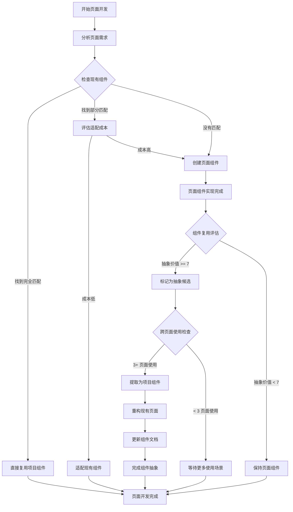

# 前端编程规范与要求

## 📋 目录

1. [代码风格规范](#代码风格规范)
2. [Vue.js 开发规范](#vuejs-开发规范)
3. [组件化开发](#组件化开发)
4. [TypeScript 规范](#typescript-规范)
5. [DDD 架构设计](#ddd-架构设计)
6. [文件组织结构](#文件组织结构)
7. [API 调用规范](#api-调用规范)
8. [样式编写规范](#样式编写规范)
9. [性能优化要求](#性能优化要求)
10. [错误处理规范](#错误处理规范)
11. [测试要求](#测试要求)
12. [最佳实践总结](#最佳实践总结)

## 🎨 代码风格规范

### 基本原则
- **一致性**: 保持代码风格的一致性，使用自动化工具确保规范执行
- **可读性**: 代码应该易于理解和维护，优先考虑代码的表达力
- **简洁性**: 避免冗余代码，保持简洁但不失清晰
- **可扩展性**: 考虑未来的扩展需求，编写可维护的代码
- **类型安全**: 充分利用 TypeScript 的类型系统

### 1. ESLint 配置

#### 1.1 基础配置
```javascript
// .eslintrc.js
module.exports = {
  root: true,
  env: {
    browser: true,
    es2021: true,
    node: true
  },
  extends: [
    'eslint:recommended',
    '@typescript-eslint/recommended',
    '@vue/eslint-config-typescript',
    '@vue/eslint-config-prettier',
    'plugin:vue/vue3-recommended'
  ],
  parser: 'vue-eslint-parser',
  parserOptions: {
    ecmaVersion: 'latest',
    parser: '@typescript-eslint/parser',
    sourceType: 'module'
  },
  plugins: [
    '@typescript-eslint',
    'vue'
  ],
  rules: {
    // TypeScript 规则
    '@typescript-eslint/no-unused-vars': 'error',
    '@typescript-eslint/no-explicit-any': 'warn',
    '@typescript-eslint/explicit-function-return-type': 'off',
    '@typescript-eslint/explicit-module-boundary-types': 'off',
    '@typescript-eslint/no-non-null-assertion': 'warn',
    '@typescript-eslint/prefer-const': 'error',
    '@typescript-eslint/no-var-requires': 'error',
    
    // Vue 规则
    'vue/multi-word-component-names': 'error',
    'vue/component-definition-name-casing': ['error', 'PascalCase'],
    'vue/component-name-in-template-casing': ['error', 'PascalCase'],
    'vue/custom-event-name-casing': ['error', 'camelCase'],
    'vue/define-emits-declaration': ['error', 'type-based'],
    'vue/define-props-declaration': ['error', 'type-based'],
    'vue/no-unused-vars': 'error',
    'vue/no-v-html': 'warn',
    'vue/require-default-prop': 'off',
    'vue/require-explicit-emits': 'error',
    
    // 通用规则
    'no-console': process.env.NODE_ENV === 'production' ? 'warn' : 'off',
    'no-debugger': process.env.NODE_ENV === 'production' ? 'warn' : 'off',
    'no-unused-vars': 'off', // 使用 TypeScript 版本
    'prefer-const': 'error',
    'no-var': 'error',
    'object-shorthand': 'error',
    'prefer-template': 'error'
  },
  overrides: [
    {
      files: ['*.vue'],
      rules: {
        'vue/component-tags-order': ['error', {
          order: ['template', 'script', 'style']
        }]
      }
    }
  ]
}
```

#### 1.2 忽略配置
```bash
# .eslintignore
node_modules/
dist/
build/
public/
*.min.js
*.d.ts
coverage/
.nuxt/
.output/
.vite/
```

### 2. Prettier 配置

#### 2.1 基础配置
```json
// .prettierrc
{
  "semi": false,
  "singleQuote": true,
  "quoteProps": "as-needed",
  "trailingComma": "es5",
  "tabWidth": 2,
  "useTabs": false,
  "printWidth": 100,
  "bracketSpacing": true,
  "bracketSameLine": false,
  "arrowParens": "avoid",
  "endOfLine": "lf",
  "vueIndentScriptAndStyle": false,
  "singleAttributePerLine": false
}
```

#### 2.2 忽略配置
```bash
# .prettierignore
node_modules/
dist/
build/
public/
*.min.js
*.min.css
coverage/
.nuxt/
.output/
.vite/
CHANGELOG.md
```

### 3. 命名规范

#### 3.1 变量和函数命名
```typescript
// ✅ 推荐：使用 camelCase
const userName = 'john'
const userAge = 25
const isUserActive = true

// ✅ 推荐：函数名动词开头
const getUserInfo = () => {}
const validateEmail = (email: string) => {}
const handleUserClick = () => {}

// ✅ 推荐：布尔值使用 is/has/can/should 前缀
const isLoading = ref(false)
const hasPermission = computed(() => true)
const canEdit = ref(true)
const shouldShowModal = ref(false)

// ✅ 推荐：事件处理函数使用 handle 前缀
const handleSubmit = () => {}
const handleCancel = () => {}
const handleUserSelect = (user: User) => {}

// ❌ 避免：缩写和不清晰的命名
const usr = 'john'  // 应该是 user 或 userName
const calc = () => {}  // 应该是 calculate
const btn = ref()  // 应该是 button 或 submitButton
```

#### 3.2 常量命名
```typescript
// ✅ 推荐：使用 UPPER_SNAKE_CASE
const API_BASE_URL = 'https://api.example.com'
const MAX_RETRY_COUNT = 3
const DEFAULT_PAGE_SIZE = 20
const HTTP_STATUS_CODES = {
  OK: 200,
  NOT_FOUND: 404,
  INTERNAL_SERVER_ERROR: 500
} as const

// ✅ 推荐：枚举使用 PascalCase
enum UserRole {
  Admin = 'admin',
  User = 'user',
  Guest = 'guest'
}

enum ApiEndpoint {
  Users = '/api/users',
  Orders = '/api/orders',
  Products = '/api/products'
}
```

#### 3.3 组件和文件命名
```typescript
// ✅ 推荐：组件名使用 PascalCase
const UserProfile = defineComponent({})
const ApiManagement = defineComponent({})
const DataTableFilter = defineComponent({})

// ✅ 推荐：文件名使用 kebab-case
// user-profile.vue
// api-management.vue
// data-table-filter.vue
// user-form-dialog.vue

// ✅ 推荐：页面文件使用 PascalCase 或 index.vue
// views/UserManagement/index.vue
// views/UserManagement/UserManagement.vue
// views/user-management/index.vue

// ✅ 推荐：工具文件使用 camelCase
// utils/formatDate.ts
// utils/validateForm.ts
// composables/useUserData.ts
```

### 4. 代码格式化规范

#### 4.1 基本格式
```typescript
// ✅ 推荐：使用 2 个空格缩进
const config = {
  apiUrl: 'https://api.example.com',
  timeout: 5000,
  retries: 3
}

// ✅ 推荐：对象和数组的尾随逗号
const items = [
  'item1',
  'item2',
  'item3', // 尾随逗号便于版本控制
]

const userConfig = {
  name: 'John',
  email: 'john@example.com',
  role: 'admin', // 尾随逗号
}

// ✅ 推荐：函数参数适当换行
const createUser = (
  name: string,
  email: string,
  phone: string,
  address: string
): Promise<User> => {
  // 实现
}

// ✅ 推荐：链式调用换行
const result = users
  .filter(user => user.isActive)
  .map(user => user.name)
  .sort()
  .join(', ')
```

#### 4.2 导入语句格式
```typescript
// ✅ 推荐：导入语句分组和排序
// 1. Node.js 内置模块
import { readFile } from 'fs/promises'
import path from 'path'

// 2. 第三方库
import { ref, computed, onMounted } from 'vue'
import { ElMessage, ElForm } from 'element-plus'
import axios from 'axios'

// 3. 项目内部模块 - 按路径层级排序
import type { User, UserRole } from '@/types/user'
import { userApi } from '@/api/user'
import { validateEmail } from '@/utils/validation'
import UserForm from '@/components/UserForm.vue'

// ✅ 推荐：类型导入使用 type 关键字
import type { FormInstance, FormRules } from 'element-plus'
import type { RouteLocationNormalized } from 'vue-router'

// ✅ 推荐：默认导入和命名导入分开
import UserService from '@/services/UserService'
import { createUser, updateUser, deleteUser } from '@/api/user'
```

#### 4.3 注释规范
```typescript
/**
 * 用户数据管理组合式函数
 * @description 提供用户数据的增删改查功能
 * @example
 * ```typescript
 * const { users, loading, fetchUsers, createUser } = useUserData()
 * await fetchUsers()
 * ```
 */
export const useUserData = () => {
  // 状态定义
  const users = ref<User[]>([])
  const loading = ref(false)
  const error = ref<string | null>(null)

  /**
   * 获取用户列表
   * @param params 查询参数
   * @returns Promise<void>
   */
  const fetchUsers = async (params?: UserQueryParams): Promise<void> => {
    loading.value = true
    error.value = null

    try {
      const response = await userApi.getUsers(params)
      users.value = response.data
    } catch (err) {
      // 错误处理
      error.value = err instanceof Error ? err.message : '获取用户失败'
      throw err
    } finally {
      loading.value = false
    }
  }

  return {
    users: readonly(users),
    loading: readonly(loading),
    error: readonly(error),
    fetchUsers
  }
}

// ✅ 推荐：单行注释说明复杂逻辑
const calculateUserScore = (user: User): number => {
  // 基础分数：根据用户等级计算
  let score = user.level * 10

  // 活跃度加成：最近30天登录次数
  const activityBonus = Math.min(user.recentLogins, 10) * 2

  // 完成度加成：个人资料完整度
  const profileBonus = user.profileCompleteness * 5

  return score + activityBonus + profileBonus
}
```

### 5. TypeScript 代码规范

#### 5.1 类型定义
```typescript
// ✅ 推荐：使用接口定义对象类型
interface User {
  readonly id: string
  name: string
  email: string
  role: UserRole
  createdAt: Date
  updatedAt: Date
}

// ✅ 推荐：使用类型别名定义联合类型
type UserRole = 'admin' | 'user' | 'guest'
type ApiResponse<T> = {
  data: T
  message: string
  success: boolean
}

// ✅ 推荐：使用泛型提高复用性
interface PaginatedResponse<T> {
  items: T[]
  total: number
  page: number
  pageSize: number
}

// ✅ 推荐：使用工具类型
type CreateUserRequest = Omit<User, 'id' | 'createdAt' | 'updatedAt'>
type UpdateUserRequest = Partial<Pick<User, 'name' | 'email' | 'role'>>
type UserListItem = Pick<User, 'id' | 'name' | 'email' | 'role'>
```

#### 5.2 函数类型定义
```typescript
// ✅ 推荐：明确的函数返回类型
const getUserById = async (id: string): Promise<User | null> => {
  try {
    const response = await userApi.getUser(id)
    return response.data
  } catch (error) {
    if (error.status === 404) {
      return null
    }
    throw error
  }
}

// ✅ 推荐：使用函数重载处理多种参数情况
function formatDate(date: Date): string
function formatDate(date: string): string
function formatDate(date: number): string
function formatDate(date: Date | string | number): string {
  const d = new Date(date)
  return d.toISOString().split('T')[0]
}

// ✅ 推荐：事件处理函数类型
type EventHandler<T = Event> = (event: T) => void
type AsyncEventHandler<T = Event> = (event: T) => Promise<void>

const handleSubmit: AsyncEventHandler<SubmitEvent> = async (event) => {
  event.preventDefault()
  // 处理提交
}
```

## 🔧 Vue.js 开发规范

### 组件结构顺序
```vue
<template>
  <!-- 模板内容 -->
  <div class="form-container">
    <el-form 
      ref="formRef"
      :model="form" 
      :rules="rules"
      label-width="120px"
    >
      <el-form-item label="姓名" prop="name">
        <el-input v-model="form.name" placeholder="请输入姓名" />
      </el-form-item>
      <el-form-item label="邮箱" prop="email">
        <el-input v-model="form.email" placeholder="请输入邮箱" />
      </el-form-item>
    </el-form>
    
    <div class="form-actions">
      <el-button @click="handleCancel">取消</el-button>
      <el-button 
        type="primary" 
        :loading="loading"
        :disabled="!isValid"
        @click="handleSave"
      >
        保存
      </el-button>
    </div>
  </div>
</template>

<script setup lang="ts">
// 1. 导入语句 - 按类型分组
import { ref, reactive, computed, onMounted, nextTick } from 'vue'
import { ElMessage, ElForm } from 'element-plus'
import type { FormInstance, FormRules } from 'element-plus'

// 2. 类型定义
interface FormData {
  name: string
  email: string
}

interface Props {
  visible: boolean
  data?: FormData
  mode?: 'create' | 'edit'
}

interface Emits {
  save: [data: FormData]
  cancel: []
  'update:visible': [value: boolean]
}

// 3. Props 定义 - 使用 withDefaults
const props = withDefaults(defineProps<Props>(), {
  mode: 'create'
})

// 4. Emits 定义
const emit = defineEmits<Emits>()

// 5. 模板引用
const formRef = ref<FormInstance>()

// 6. 响应式数据
const loading = ref(false)
const form = reactive<FormData>({
  name: '',
  email: ''
})

// 7. 表单验证规则
const rules: FormRules<FormData> = {
  name: [
    { required: true, message: '请输入姓名', trigger: 'blur' },
    { min: 2, max: 20, message: '姓名长度在 2 到 20 个字符', trigger: 'blur' }
  ],
  email: [
    { required: true, message: '请输入邮箱', trigger: 'blur' },
    { type: 'email', message: '请输入正确的邮箱格式', trigger: 'blur' }
  ]
}

// 8. 计算属性
const isValid = computed(() => {
  return form.name.trim() && form.email.trim() && /\S+@\S+\.\S+/.test(form.email)
})

// 9. 监听器
watch(() => props.data, (newData) => {
  if (newData) {
    Object.assign(form, newData)
  }
}, { immediate: true })

watch(() => props.visible, (visible) => {
  if (visible) {
    nextTick(() => {
      formRef.value?.clearValidate()
    })
  }
})

// 10. 方法定义
const handleSave = async () => {
  if (!formRef.value) return
  
  try {
    await formRef.value.validate()
    loading.value = true
    
    // 模拟API调用
    await new Promise(resolve => setTimeout(resolve, 1000))
    
    emit('save', { ...form })
    emit('update:visible', false)
    ElMessage.success('保存成功')
  } catch (error) {
    console.error('表单验证失败:', error)
  } finally {
    loading.value = false
  }
}

const handleCancel = () => {
  emit('cancel')
  emit('update:visible', false)
}

const resetForm = () => {
  formRef.value?.resetFields()
}

// 11. 生命周期钩子
onMounted(() => {
  // 初始化逻辑
  console.log('组件已挂载')
})

// 12. 暴露给父组件的方法
defineExpose({
  resetForm,
  validate: () => formRef.value?.validate()
})
</script>

<style scoped>
.form-container {
  padding: 20px;
}

.form-actions {
  margin-top: 20px;
  text-align: right;
}

.form-actions .el-button {
  margin-left: 10px;
}
</style>
```

### Props 和 Emits 规范

#### Props 最佳实践
```typescript
// 1. 使用接口定义复杂Props类型
interface ComponentProps {
  // 必需属性
  title: string
  visible: boolean
  
  // 可选属性
  data?: FormData
  size?: 'small' | 'medium' | 'large'
  variant?: 'primary' | 'secondary' | 'danger'
  
  // 带默认值的属性
  maxLength?: number
  disabled?: boolean
  loading?: boolean
}

// 2. 使用 withDefaults 设置默认值
const props = withDefaults(defineProps<ComponentProps>(), {
  size: 'medium',
  variant: 'primary',
  maxLength: 100,
  disabled: false,
  loading: false
})

// 3. 复杂默认值使用工厂函数
interface ListProps {
  items?: string[]
  config?: Record<string, unknown>
}

const props = withDefaults(defineProps<ListProps>(), {
  items: () => [],
  config: () => ({})
})
```

#### Emits 最佳实践
```typescript
// 1. 明确定义事件类型和参数
interface ComponentEmits {
  // v-model 支持
  'update:visible': [value: boolean]
  'update:modelValue': [value: string]
  
  // 业务事件
  'save': [data: FormData]
  'delete': [id: string]
  'change': [value: string, oldValue: string]
  
  // 无参数事件
  'cancel': []
  'reset': []
  
  // 复杂参数事件
  'select': [item: { id: string; name: string }, index: number]
}

const emit = defineEmits<ComponentEmits>()

// 2. 事件验证（开发环境）
const emit = defineEmits({
  'update:visible': (value: boolean) => typeof value === 'boolean',
  'save': (data: FormData) => data && typeof data === 'object',
  'delete': (id: string) => typeof id === 'string' && id.length > 0
})

// 3. 使用示例
const handleSave = () => {
  emit('save', formData)
  emit('update:visible', false)
}

const handleChange = (newValue: string, oldValue: string) => {
  emit('change', newValue, oldValue)
}
```

#### v-model 支持
```typescript
// 单个 v-model
interface Props {
  modelValue: string
}

interface Emits {
  'update:modelValue': [value: string]
}

// 多个 v-model
interface Props {
  visible: boolean
  title: string
  data: FormData
}

interface Emits {
  'update:visible': [value: boolean]
  'update:title': [value: string]
  'update:data': [value: FormData]
}

// 使用示例
// <MyComponent v-model:visible="dialogVisible" v-model:title="dialogTitle" />
```

### 响应式数据规范
```javascript
// 使用 ref 处理基本类型
const loading = ref(false)
const count = ref(0)
const message = ref('')

// 使用 reactive 处理对象
const form = reactive({
  name: '',
  email: '',
  phone: ''
})

const state = reactive({
  loading: false,
  data: [],
  error: null
})

// 避免解构 reactive 对象
// ❌ 错误
const { loading, data } = state

// ✅ 正确
const { loading, data } = toRefs(state)
```

### Composables 规范

#### 基础 Composables
```typescript
// 1. 简单状态管理
export function useCounter(initialValue = 0) {
  const count = ref(initialValue)
  
  const increment = (step = 1) => {
    count.value += step
  }
  
  const decrement = (step = 1) => {
    count.value -= step
  }
  
  const reset = () => {
    count.value = initialValue
  }
  
  return {
    count: readonly(count),
    increment,
    decrement,
    reset
  }
}

// 2. 布尔状态切换
export function useToggle(initialValue = false) {
  const state = ref(initialValue)
  
  const toggle = () => {
    state.value = !state.value
  }
  
  const setTrue = () => {
    state.value = true
  }
  
  const setFalse = () => {
    state.value = false
  }
  
  return {
    state: readonly(state),
    toggle,
    setTrue,
    setFalse
  }
}
```

#### 异步数据获取
```typescript
// 通用API请求Hook
interface UseApiOptions<T> {
  immediate?: boolean
  onSuccess?: (data: T) => void
  onError?: (error: Error) => void
  transform?: (data: any) => T
}

export function useApi<T = any>(
  url: MaybeRef<string>,
  options: UseApiOptions<T> = {}
) {
  const {
    immediate = true,
    onSuccess,
    onError,
    transform
  } = options
  
  const data = ref<T | null>(null)
  const loading = ref(false)
  const error = ref<Error | null>(null)
  
  const execute = async () => {
    loading.value = true
    error.value = null
    
    try {
      const response = await api.get(unref(url))
      const result = transform ? transform(response.data) : response.data
      data.value = result
      onSuccess?.(result)
    } catch (err) {
      const errorObj = err instanceof Error ? err : new Error(String(err))
      error.value = errorObj
      onError?.(errorObj)
    } finally {
      loading.value = false
    }
  }
  
  // 监听URL变化自动重新请求
  watch(() => unref(url), execute, { immediate })
  
  return {
    data: readonly(data),
    loading: readonly(loading),
    error: readonly(error),
    execute,
    refresh: execute
  }
}

// 表单处理Hook
interface UseFormOptions<T> {
  initialValues: T
  validationRules?: Record<keyof T, (value: any) => string | null>
  onSubmit?: (values: T) => Promise<void> | void
}

export function useForm<T extends Record<string, any>>(
  options: UseFormOptions<T>
) {
  const { initialValues, validationRules, onSubmit } = options
  
  const values = reactive<T>({ ...initialValues })
  const errors = reactive<Partial<Record<keyof T, string>>>({})
  const touched = reactive<Partial<Record<keyof T, boolean>>>({})
  const submitting = ref(false)
  
  const validate = (field?: keyof T) => {
    if (!validationRules) return true
    
    const fieldsToValidate = field ? [field] : Object.keys(validationRules) as (keyof T)[]
    let isValid = true
    
    fieldsToValidate.forEach(key => {
      const rule = validationRules[key]
      if (rule) {
        const error = rule(values[key])
        if (error) {
          errors[key] = error
          isValid = false
        } else {
          delete errors[key]
        }
      }
    })
    
    return isValid
  }
  
  const handleSubmit = async () => {
    if (!validate() || !onSubmit) return
    
    submitting.value = true
    try {
      await onSubmit(values)
    } finally {
      submitting.value = false
    }
  }
  
  const reset = () => {
    Object.assign(values, initialValues)
    Object.keys(errors).forEach(key => delete errors[key])
    Object.keys(touched).forEach(key => delete touched[key])
  }
  
  const setFieldValue = (field: keyof T, value: any) => {
    values[field] = value
    touched[field] = true
    validate(field)
  }
  
  return {
    values,
    errors: readonly(errors),
    touched: readonly(touched),
    submitting: readonly(submitting),
    validate,
    handleSubmit,
    reset,
    setFieldValue
  }
}
```

## 🧩 组件化开发

### 组件拆分原则
1. **单一职责**: 每个组件只负责一个功能
2. **可复用性**: 组件应该可以在多个地方复用
3. **可组合性**: 组件可以组合成更复杂的功能
4. **可测试性**: 组件应该易于测试

### 组件分类
```
components/
├── base/           # 基础组件（按钮、输入框等）
│   ├── BaseButton.vue
│   ├── BaseInput.vue
│   └── BaseModal.vue
├── business/       # 业务组件
│   ├── UserProfile.vue
│   ├── ApiForm.vue
│   └── DataTable.vue
└── layout/         # 布局组件
    ├── Header.vue
    ├── Sidebar.vue
    └── Footer.vue
```

### 组件通信规范
```javascript
// 父子组件通信使用 props 和 emits
// 父组件
<template>
  <UserForm 
    :data="userData"
    @save="handleSave"
    @cancel="handleCancel"
  />
</template>

// 子组件
const props = defineProps<{
  data: UserData
}>()

const emit = defineEmits<{
  save: [data: UserData]
  cancel: []
}>()

// 跨组件通信使用 provide/inject 或状态管理
// 提供者
provide('userService', userService)

// 注入者
const userService = inject('userService')
```

### 组件文档规范
```vue
<!--
组件名称: ApiFormDialog
功能描述: API表单弹框组件，用于新增和编辑API信息
作者: [作者名]
创建时间: 2024-01-20
最后修改: 2024-01-20

Props:
- visible: boolean - 控制弹框显示/隐藏
- title: string - 弹框标题
- formData: ApiFormData - 表单数据

Events:
- save: (data: ApiFormData) => void - 保存事件
- cancel: () => void - 取消事件

使用示例:
<ApiFormDialog
  v-model:visible="dialogVisible"
  :title="dialogTitle"
  :form-data="formData"
  @save="handleSave"
  @cancel="handleCancel"
/>
-->
```

### 页面开发流程规范

#### 开发流程概述

采用渐进式开发方法，确保代码质量和组件复用性：

```
需求分析 → 组件规划 → 快速实现 → 重构优化 → 组件抽象
```

#### 1. 需求分析和组件规划

##### 1.1 功能分解
```typescript
// 页面功能清单
interface PageFeatures {
  name: string
  layout: string[]        // 布局区域
  components: string[]    // 需要的组件
  interactions: string[]  // 交互功能
  dataFlow: string[]      // 数据流向
}

// 示例：用户管理页面
const userManagementFeatures: PageFeatures = {
  name: '用户管理',
  layout: ['页面头部', '筛选区域', '数据表格', '操作按钮'],
  components: ['用户列表', '用户表单', '筛选器', '确认对话框'],
  interactions: ['搜索筛选', '新增编辑', '删除确认', '批量操作'],
  dataFlow: ['获取列表', '表单提交', '状态更新', '错误处理']
}
```

##### 1.2 组件复用检查
```typescript
// 简化的复用检查流程
const checkComponentReuse = (requiredComponents: string[]) => {
  const reuseMap = new Map<string, 'reuse' | 'adapt' | 'create'>()
  
  requiredComponents.forEach(component => {
    // 检查现有组件库
    if (existsInBaseComponents(component)) {
      reuseMap.set(component, 'reuse')
    } else if (existsInBusinessComponents(component)) {
      reuseMap.set(component, 'adapt')
    } else {
      reuseMap.set(component, 'create')
    }
  })
  
  return reuseMap
}

// 组件决策原则
const componentDecisionRules = {
  reuse: '直接使用现有组件，无需修改',
  adapt: '基于现有组件进行适配或扩展',
  create: '创建新的页面级组件'
}
```

#### 2. 快速实现阶段

##### 2.1 页面目录结构
```
views/
└── user-management/              # 页面目录
    ├── index.vue                 # 页面入口文件
    ├── components/               # 页面专用组件
    │   ├── UserList.vue         
    │   ├── UserForm.vue         
    │   └── UserFilter.vue       
    ├── composables/             # 页面业务逻辑
    │   └── useUserManagement.ts 
    └── types.ts                 # 页面类型定义
```

##### 2.2 页面主文件实现
```vue
<!-- views/user-management/index.vue -->
<template>
  <div class="user-management-page">
    <!-- 页面头部 -->
    <div class="page-header">
      <h1>用户管理</h1>
      <el-button type="primary" @click="handleCreate">
        新增用户
      </el-button>
    </div>
    
    <!-- 筛选区域 -->
    <UserFilter 
      v-model="filters"
      @search="handleSearch"
      @reset="handleReset"
    />
    
    <!-- 用户列表 -->
    <UserList
      :data="users"
      :loading="loading"
      @edit="handleEdit"
      @delete="handleDelete"
    />
    
    <!-- 用户表单弹框 -->
    <UserForm
      v-model:visible="formVisible"
      :form-data="currentUser"
      :mode="formMode"
      @save="handleSave"
    />
  </div>
</template>

<script setup lang="ts">
import { onMounted } from 'vue'
import { useUserManagement } from './composables/useUserManagement'
import UserFilter from './components/UserFilter.vue'
import UserList from './components/UserList.vue'
import UserForm from './components/UserForm.vue'

// 页面逻辑集中管理
const {
  users,
  loading,
  filters,
  formVisible,
  currentUser,
  formMode,
  handleSearch,
  handleReset,
  handleCreate,
  handleEdit,
  handleDelete,
  handleSave
} = useUserManagement()

// 页面初始化
onMounted(() => {
  handleSearch()
})
</script>

<style scoped>
.user-management-page {
  padding: 20px;
}

.page-header {
  display: flex;
  justify-content: space-between;
  align-items: center;
  margin-bottom: 20px;
}
</style>
```

###### 3.3 页面级组件实现
```vue
<!-- views/user-management/components/UserList.vue -->
<template>
  <div class="user-list">
    <div class="list-header">
      <h3>用户列表 ({{ users.length }})</h3>
      <el-button type="primary" @click="$emit('create')">
        新增用户
      </el-button>
    </div>
    
    <DataTable
      :data="users"
      :columns="columns"
      :loading="loading"
      @row-action="handleRowAction"
    />
  </div>
</template>

<script setup lang="ts">
import { computed } from 'vue';
import DataTable from '@/components/base/DataTable.vue';
import type { User } from '../types';

// Props 定义
const props = defineProps<{
  users: User[];
  loading: boolean;
}>();

// Events 定义
const emit = defineEmits<{
  create: [];
  edit: [user: User];
  delete: [userId: string];
}>();

// 表格列配置
const columns = computed(() => [
  { prop: 'name', label: '姓名', width: 120 },
  { prop: 'email', label: '邮箱', width: 200 },
  { prop: 'role', label: '角色', width: 100 },
  { prop: 'status', label: '状态', width: 100 },
  { prop: 'actions', label: '操作', width: 150, type: 'actions' }
]);

// 行操作处理
const handleRowAction = (action: string, row: User) => {
  switch (action) {
    case 'edit':
      emit('edit', row);
      break;
    case 'delete':
      emit('delete', row.id);
      break;
  }
};
</script>
```

#### 4. 组件抽象阶段

##### 4.1 抽象时机判断
```typescript
// 组件抽象评估清单
interface AbstractionChecklist {
  // 复用性指标
  usedInMultiplePages: boolean;     // 是否在多个页面使用
  similarPatternsExist: boolean;    // 是否存在相似模式
  futureReusePotential: boolean;    // 是否有未来复用潜力
  
  // 稳定性指标
  apiStable: boolean;               // API 是否稳定
  uiPatternMature: boolean;         // UI 模式是否成熟
  businessLogicClear: boolean;      // 业务逻辑是否清晰
  
  // 维护性指标
  reasonableComplexity: boolean;    // 复杂度是否合理
  clearResponsibility: boolean;     // 职责是否清晰
  lowCoupling: boolean;            // 耦合度是否较低
}

// 抽象决策函数
function shouldAbstractComponent(checklist: AbstractionChecklist): boolean {
  const reusabilityScore = [
    checklist.usedInMultiplePages,
    checklist.similarPatternsExist,
    checklist.futureReusePotential
  ].filter(Boolean).length;
  
  const stabilityScore = [
    checklist.apiStable,
    checklist.uiPatternMature,
    checklist.businessLogicClear
  ].filter(Boolean).length;
  
  const maintainabilityScore = [
    checklist.reasonableComplexity,
    checklist.clearResponsibility,
    checklist.lowCoupling
  ].filter(Boolean).length;
  
  // 至少满足两个维度的大部分条件
  return (reusabilityScore >= 2 && stabilityScore >= 2) ||
         (reusabilityScore >= 2 && maintainabilityScore >= 2) ||
         (stabilityScore >= 3 && maintainabilityScore >= 2);
}
```

##### 4.2 组件抽象层级
```typescript
// 组件抽象层级定义
enum ComponentLevel {
  PAGE = 'page',           // 页面级组件 (views/*/components/)
  BUSINESS = 'business',   // 业务级组件 (components/business/)
  BASE = 'base'           // 基础级组件 (components/base/)
}

// 抽象层级决策
function determineComponentLevel(component: string): ComponentLevel {
  // 基础级：通用 UI 组件，无业务逻辑
  const basePatterns = ['Button', 'Input', 'Table', 'Modal', 'Form'];
  if (basePatterns.some(pattern => component.includes(pattern))) {
    return ComponentLevel.BASE;
  }
  
  // 业务级：包含业务逻辑但可跨页面复用
  const businessPatterns = ['Filter', 'Search', 'Upload', 'Chart'];
  if (businessPatterns.some(pattern => component.includes(pattern))) {
    return ComponentLevel.BUSINESS;
  }
  
  // 页面级：特定页面的组件
  return ComponentLevel.PAGE;
}
```

##### 4.3 组件抽象实施步骤

```typescript
// 组件抽象实施流程
interface ComponentAbstractionPlan {
  // 第一步：分析现有组件
  analyzeExistingComponents(): ComponentAnalysis {
    return {
      commonProps: string[];      // 共同属性
      commonMethods: string[];    // 共同方法
      differences: string[];      // 差异点
      abstractionLevel: ComponentLevel;
    };
  }
  
  // 第二步：设计通用接口
  designGenericInterface<T>(): GenericComponentProps<T> {
    return {
      // 通用属性定义
      data: T;
      loading?: boolean;
      disabled?: boolean;
      // 通用事件定义
      onChange?: (value: T) => void;
      onSubmit?: (value: T) => void;
      onCancel?: () => void;
    };
  }
  
  // 第三步：创建抽象组件
  createAbstractComponent(): void {
    // 1. 在对应目录创建组件文件
    // 2. 实现通用逻辑
    // 3. 提供插槽和配置选项
    // 4. 编写组件文档
  }
  
  // 第四步：迁移现有使用
  migrateExistingUsage(): void {
    // 1. 逐步替换页面组件
    // 2. 保持向后兼容
    // 3. 更新相关测试
    // 4. 清理旧代码
  }
}

// 组件抽象示例：FilterComponent
interface FilterComponentProps<T = Record<string, any>> {
  // 数据相关
  modelValue: T;
  fields: FilterField[];
  
  // 行为相关
  searchOnChange?: boolean;
  resetToDefault?: boolean;
  
  // 样式相关
  layout?: 'horizontal' | 'vertical' | 'inline';
  size?: 'small' | 'medium' | 'large';
  
  // 事件
  onSearch?: (filters: T) => void;
  onReset?: () => void;
  onChange?: (filters: T) => void;
}

// 使用示例
const userFilterConfig: FilterField[] = [
  { key: 'name', label: '用户名', type: 'input' },
  { key: 'role', label: '角色', type: 'select', options: roleOptions },
  { key: 'status', label: '状态', type: 'select', options: statusOptions }
];
```

#### 组件生命周期管理

```typescript
// 组件从页面级到项目级的演进路径
enum ComponentLifecycle {
  PAGE_SPECIFIC = 'page-specific',     // 页面特定组件
  PAGE_REUSABLE = 'page-reusable',     // 页面内复用组件
  CROSS_PAGE = 'cross-page',           // 跨页面组件
  PROJECT_COMPONENT = 'project-component', // 项目级组件
  BASE_COMPONENT = 'base-component'    // 基础组件
}

// 组件升级路径
const componentUpgradePath = {
  [ComponentLifecycle.PAGE_SPECIFIC]: {
    nextLevel: ComponentLifecycle.PAGE_REUSABLE,
    criteria: '在同一页面内被多次使用',
    action: '提取为页面级可复用组件'
  },
  [ComponentLifecycle.PAGE_REUSABLE]: {
    nextLevel: ComponentLifecycle.CROSS_PAGE,
    criteria: '在多个页面中出现相似需求',
    action: '分析跨页面复用可能性'
  },
  [ComponentLifecycle.CROSS_PAGE]: {
    nextLevel: ComponentLifecycle.PROJECT_COMPONENT,
    criteria: '3个或以上页面使用相似组件',
    action: '抽象为项目级通用组件'
  },
  [ComponentLifecycle.PROJECT_COMPONENT]: {
    nextLevel: ComponentLifecycle.BASE_COMPONENT,
    criteria: '组件足够通用且稳定',
    action: '提升为基础组件库'
  }
};
```

#### 最佳实践总结

1. **先实现后抽象**: 避免过早优化，先完成功能实现
2. **渐进式重构**: 组件抽象应该是渐进的，不要一次性大规模重构
3. **数据驱动决策**: 基于实际使用数据和复用情况做抽象决策
4. **保持向后兼容**: 组件升级时要考虑现有使用方的兼容性
5. **文档同步更新**: 组件抽象后及时更新文档和使用指南

#### 工具和检查清单

```typescript
// 开发检查清单
const developmentChecklist = {
  beforeDevelopment: [
    '✓ 分析页面需求和功能点',
    '✓ 检查现有组件复用可能性',
    '✓ 确定页面目录结构',
    '✓ 设计组件拆分方案'
  ],
  duringDevelopment: [
    '✓ 遵循单一职责原则',
    '✓ 保持组件接口清晰',
    '✓ 编写组件文档注释',
    '✓ 实现单元测试'
  ],
  afterDevelopment: [
    '✓ 评估组件抽象价值',
    '✓ 检查跨页面复用机会',
    '✓ 更新组件库文档',
    '✓ 进行代码审查'
  ]
};

// 自动化工具建议
 const automationTools = {
   componentAnalysis: 'vue-component-analyzer', // 组件分析工具
   duplicateDetection: 'jscpd',                // 重复代码检测
   dependencyGraph: 'madge',                   // 依赖关系图
   testCoverage: 'vitest'                      // 测试覆盖率
 };
 ```

#### 组件复用和抽象决策流程图



#### 实用决策工具

##### 1. 组件复用决策矩阵

```typescript
// 快速决策工具
class ComponentReuseDecisionTool {
  // 评估现有组件的复用可能性
  static evaluateReuse(requirement: any, existingComponent: any): ReuseDecision {
    const scores = {
      functionalMatch: this.calculateFunctionalMatch(requirement, existingComponent),
      uiMatch: this.calculateUIMatch(requirement, existingComponent),
      adaptationCost: this.calculateAdaptationCost(requirement, existingComponent),
      maintenanceImpact: this.calculateMaintenanceImpact(requirement, existingComponent)
    };
    
    const totalScore = Object.values(scores).reduce((sum, score) => sum + score, 0) / 4;
    
    if (totalScore >= 8) return { type: 'direct', confidence: 'high' };
    if (totalScore >= 6) return { type: 'adapt', confidence: 'medium' };
    return { type: 'create', confidence: 'low' };
  }
  
  // 评估组件抽象价值
  static evaluateAbstraction(component: any): AbstractionDecision {
    const criteria = {
      complexity: this.assessComplexity(component),      // 1-10
      reusability: this.assessReusability(component),    // 1-10
      stability: this.assessStability(component),        // 1-10
      businessCoupling: this.assessBusinessCoupling(component) // 1-10 (低耦合高分)
    };
    
    const weightedScore = 
      criteria.complexity * 0.2 +
      criteria.reusability * 0.3 +
      criteria.stability * 0.3 +
      criteria.businessCoupling * 0.2;
    
    return {
      score: weightedScore,
      recommendation: weightedScore >= 7 ? 'abstract' : 'keep-local',
      reasons: this.generateReasons(criteria)
    };
  }
}

interface ReuseDecision {
  type: 'direct' | 'adapt' | 'create';
  confidence: 'high' | 'medium' | 'low';
}

interface AbstractionDecision {
  score: number;
  recommendation: 'abstract' | 'keep-local';
  reasons: string[];
}
```

##### 2. 组件抽象检查清单

```typescript
// 抽象前检查清单
const abstractionChecklist = {
  technical: [
    '✓ 组件代码复杂度适中（< 200 行）',
    '✓ 组件接口设计清晰',
    '✓ 组件具有良好的测试覆盖率',
    '✓ 组件没有硬编码的业务逻辑',
    '✓ 组件样式可配置或可主题化'
  ],
  business: [
    '✓ 组件在至少 2 个不同页面中使用',
    '✓ 组件功能相对稳定，不频繁变更',
    '✓ 组件抽象不会影响现有功能',
    '✓ 团队成员理解组件的抽象价值',
    '✓ 有足够的时间进行重构和测试'
  ],
  maintenance: [
    '✓ 抽象后的组件有明确的维护责任人',
    '✓ 组件文档完整且易于理解',
    '✓ 组件版本管理策略明确',
    '✓ 组件变更影响评估流程建立',
    '✓ 组件使用方的迁移计划制定'
  ]
};

// 检查清单验证函数
const validateAbstractionReadiness = (component: any): ValidationResult => {
  const results = {
    technical: abstractionChecklist.technical.map(item => 
      ({ item, passed: checkTechnicalCriteria(component, item) })
    ),
    business: abstractionChecklist.business.map(item => 
      ({ item, passed: checkBusinessCriteria(component, item) })
    ),
    maintenance: abstractionChecklist.maintenance.map(item => 
      ({ item, passed: checkMaintenanceCriteria(component, item) })
    )
  };
  
  const passRate = calculatePassRate(results);
  
  return {
    ready: passRate >= 0.8,
    passRate,
    failedItems: getFailedItems(results),
    recommendations: generateRecommendations(results)
  };
};
```

##### 3. 自动化检测脚本

```typescript
// 组件相似度检测脚本
class ComponentSimilarityDetector {
  static async scanProject(projectPath: string): Promise<SimilarityReport> {
    const components = await this.getAllComponents(projectPath);
    const similarities = [];
    
    for (let i = 0; i < components.length; i++) {
      for (let j = i + 1; j < components.length; j++) {
        const similarity = await this.calculateSimilarity(
          components[i], 
          components[j]
        );
        
        if (similarity.score > 0.7) {
          similarities.push({
            component1: components[i],
            component2: components[j],
            similarity,
            extractionPotential: this.assessExtractionPotential(similarity)
          });
        }
      }
    }
    
    return {
      totalComponents: components.length,
      similarPairs: similarities,
      extractionCandidates: similarities
        .filter(s => s.extractionPotential === 'high')
        .map(s => this.generateExtractionPlan(s))
    };
  }
  
  private static async calculateSimilarity(comp1: any, comp2: any): Promise<SimilarityScore> {
    return {
      structural: await this.compareStructure(comp1, comp2),
      functional: await this.compareFunctionality(comp1, comp2),
      styling: await this.compareStyling(comp1, comp2),
      props: await this.compareProps(comp1, comp2),
      score: 0 // 综合评分
    };
  }
}

interface SimilarityScore {
  structural: number;
  functional: number;
  styling: number;
  props: number;
  score: number;
}

interface SimilarityReport {
  totalComponents: number;
  similarPairs: any[];
  extractionCandidates: any[];
}
```

##### 4. 组件抽象模板生成器

```typescript
// 自动生成抽象组件模板
class ComponentAbstractionGenerator {
  static generateAbstractComponent(
    sourceComponents: ComponentInfo[], 
    targetName: string
  ): AbstractComponentTemplate {
    const commonProps = this.extractCommonProps(sourceComponents);
    const commonMethods = this.extractCommonMethods(sourceComponents);
    const configOptions = this.generateConfigOptions(sourceComponents);
    
    return {
      name: targetName,
      template: this.generateVueTemplate(commonProps, configOptions),
      script: this.generateScriptSetup(commonProps, commonMethods),
      types: this.generateTypeDefinitions(commonProps, configOptions),
      documentation: this.generateDocumentation(commonProps, commonMethods),
      migrationGuide: this.generateMigrationGuide(sourceComponents)
    };
  }
  
  private static generateVueTemplate(props: any[], config: any[]): string {
    return `
<template>
  <div :class="componentClasses">
    <slot name="header" v-if="showHeader">
      <h3>{{ title }}</h3>
    </slot>
    
    <div class="component-content">
      <slot :data="processedData" :loading="loading">
        <!-- 默认内容 -->
      </slot>
    </div>
    
    <slot name="footer" v-if="showFooter">
      <!-- 底部内容 -->
    </slot>
  </div>
</template>
    `.trim();
  }
  
  private static generateMigrationGuide(sources: ComponentInfo[]): MigrationGuide {
    return {
      steps: [
        '1. 安装新的抽象组件',
        '2. 更新导入语句',
        '3. 调整 props 传递',
        '4. 测试功能完整性',
        '5. 删除旧组件文件'
      ],
      codeExamples: sources.map(source => ({
        before: source.usage,
        after: this.generateNewUsage(source)
      })),
      breakingChanges: this.identifyBreakingChanges(sources),
      timeline: '建议在 2-3 个迭代周期内完成迁移'
    };
  }
}

interface ComponentInfo {
  name: string;
  path: string;
  props: any[];
  methods: any[];
  usage: string;
}

interface AbstractComponentTemplate {
  name: string;
  template: string;
  script: string;
  types: string;
  documentation: string;
  migrationGuide: MigrationGuide;
}

interface MigrationGuide {
   steps: string[];
   codeExamples: { before: string; after: string }[];
   breakingChanges: string[];
   timeline: string;
 }
 ```

#### 实际应用示例

##### 示例场景：API管理页面开发

假设我们需要开发一个API管理页面，以下是完整的开发流程示例：

###### 1. 需求分析
```typescript
// 1. 明确页面需求
const apiManagementRequirements = {
  pageName: 'ApiManagement',
  features: [
    'API列表展示',
    '新增API',
    '编辑API',
    '删除API',
    '搜索和筛选',
    'API测试',
    '导入/导出'
  ],
  dataModels: ['Api', 'ApiFilter', 'ApiForm', 'TestResult'],
  interactions: ['表格操作', '表单弹框', '测试面板', '确认对话框'],
  layouts: ['页面头部', '工具栏', '筛选区域', '数据表格', '分页']
};
```

###### 2. 组件复用检查
```typescript
// 2. 检查现有组件
const existingComponentsCheck = {
  reusableComponents: [
    {
      name: 'DataTable',
      path: 'src/components/base/DataTable.vue',
      match: '完全匹配 - 可直接使用'
    },
    {
      name: 'PageHeader',
      path: 'src/components/layout/PageHeader.vue',
      match: '完全匹配 - 可直接使用'
    }
  ],
  adaptableComponents: [
    {
      name: 'SearchFilter',
      path: 'src/components/business/SearchFilter.vue',
      match: '部分匹配 - 需要适配API特定字段'
    }
  ],
  missingComponents: [
    'ApiForm',      // API表单组件
    'ApiTester',    // API测试组件
    'ApiActions'    // API操作组件
  ]
};
```

###### 3. 页面实现
```vue
<!-- views/api-management/ApiManagementPage.vue -->
<template>
  <div class="api-management-page">
    <!-- 复用现有的页面头部组件 -->
    <PageHeader 
      title="API管理" 
      :breadcrumb="breadcrumb"
    >
      <template #actions>
        <el-button type="primary" @click="handleCreate">
          新增API
        </el-button>
        <el-button @click="handleImport">
          导入
        </el-button>
        <el-button @click="handleExport">
          导出
        </el-button>
      </template>
    </PageHeader>

    <!-- 适配现有的搜索筛选组件 -->
    <ApiFilter 
      v-model:filters="filters"
      @search="handleSearch"
      @reset="handleReset"
    />

    <!-- 复用现有的数据表格组件 -->
    <DataTable
      :data="apis"
      :columns="tableColumns"
      :loading="loading"
      :pagination="pagination"
      @row-action="handleRowAction"
      @page-change="handlePageChange"
    />

    <!-- 新建的API表单组件 -->
    <ApiForm
      v-model:visible="formVisible"
      :api-data="currentApi"
      :mode="formMode"
      @save="handleSave"
      @cancel="handleCancel"
    />

    <!-- 新建的API测试组件 -->
    <ApiTester
      v-model:visible="testerVisible"
      :api-data="testingApi"
      @test-complete="handleTestComplete"
      @close="handleTesterClose"
    />
  </div>
</template>

<script setup lang="ts">
import { ref, computed, onMounted } from 'vue';
import { useApiManagement } from './composables/useApiManagement';

// 复用现有组件
import PageHeader from '@/components/layout/PageHeader.vue';
import DataTable from '@/components/base/DataTable.vue';

// 适配的组件
import ApiFilter from './components/ApiFilter.vue';

// 新建的页面组件
import ApiForm from './components/ApiForm.vue';
import ApiTester from './components/ApiTester.vue';

// 使用组合式函数管理页面逻辑
const {
  apis,
  loading,
  filters,
  pagination,
  formVisible,
  testerVisible,
  currentApi,
  testingApi,
  formMode,
  handleSearch,
  handleReset,
  handleCreate,
  handleEdit,
  handleDelete,
  handleTest,
  handleSave,
  handleCancel,
  handlePageChange,
  handleImport,
  handleExport
} = useApiManagement();

// 页面特定的配置
const breadcrumb = [
  { label: '首页', to: '/' },
  { label: 'API管理', to: '/api-management' }
];

const tableColumns = computed(() => [
  { prop: 'name', label: 'API名称', width: 200 },
  { prop: 'method', label: '请求方法', width: 100 },
  { prop: 'url', label: 'URL', width: 300 },
  { prop: 'status', label: '状态', width: 100 },
  { prop: 'updateTime', label: '更新时间', width: 180 },
  { prop: 'actions', label: '操作', width: 200, type: 'actions' }
]);

const handleRowAction = (action: string, row: any) => {
  switch (action) {
    case 'edit':
      handleEdit(row);
      break;
    case 'delete':
      handleDelete(row.id);
      break;
    case 'test':
      handleTest(row);
      break;
  }
};

onMounted(() => {
  handleSearch();
});
</script>
```

###### 4. 页面组件实现
```vue
<!-- views/api-management/components/ApiFilter.vue -->
<template>
  <div class="api-filter">
    <el-form :model="localFilters" inline>
      <el-form-item label="API名称">
        <el-input 
          v-model="localFilters.name"
          placeholder="请输入API名称"
          clearable
        />
      </el-form-item>
      
      <el-form-item label="请求方法">
        <el-select 
          v-model="localFilters.method"
          placeholder="请选择请求方法"
          clearable
        >
          <el-option label="GET" value="GET" />
          <el-option label="POST" value="POST" />
          <el-option label="PUT" value="PUT" />
          <el-option label="DELETE" value="DELETE" />
        </el-select>
      </el-form-item>
      
      <el-form-item label="状态">
        <el-select 
          v-model="localFilters.status"
          placeholder="请选择状态"
          clearable
        >
          <el-option label="启用" value="enabled" />
          <el-option label="禁用" value="disabled" />
        </el-select>
      </el-form-item>
      
      <el-form-item>
        <el-button type="primary" @click="handleSearch">
          搜索
        </el-button>
        <el-button @click="handleReset">
          重置
        </el-button>
      </el-form-item>
    </el-form>
  </div>
</template>

<script setup lang="ts">
import { ref, watch } from 'vue';

interface ApiFilters {
  name?: string;
  method?: string;
  status?: string;
}

const props = defineProps<{
  filters: ApiFilters;
}>();

const emit = defineEmits<{
  'update:filters': [filters: ApiFilters];
  search: [];
  reset: [];
}>();

const localFilters = ref<ApiFilters>({ ...props.filters });

watch(
  () => props.filters,
  (newFilters) => {
    localFilters.value = { ...newFilters };
  },
  { deep: true }
);

const handleSearch = () => {
  emit('update:filters', localFilters.value);
  emit('search');
};

const handleReset = () => {
  localFilters.value = {};
  emit('update:filters', {});
  emit('reset');
};
</script>
```

###### 5. 组件抽象评估
```typescript
// 开发完成后，评估组件抽象价值
const componentEvaluations = [
  {
    componentName: 'ApiFilter',
    complexity: 'medium',
    reusability: 'high',
    businessLogic: 'light',
    uiPattern: 'common',
    abstractionValue: 8,
    recommendation: '建议抽象为通用FilterComponent'
  },
  {
    componentName: 'ApiForm',
    complexity: 'high',
    reusability: 'medium',
    businessLogic: 'heavy',
    uiPattern: 'unique',
    abstractionValue: 5,
    recommendation: '暂时保持为页面组件，观察其他页面需求'
  },
  {
    componentName: 'ApiTester',
    complexity: 'high',
    reusability: 'low',
    businessLogic: 'heavy',
    uiPattern: 'unique',
    abstractionValue: 3,
    recommendation: '保持为页面特定组件'
  }
];
```

###### 6. 跨页面复用检查
```typescript
// 假设后续开发了用户管理、角色管理页面
const crossPageAnalysis = {
  filterComponents: {
    pages: ['api-management', 'user-management', 'role-management'],
    commonPattern: {
      structure: '表单 + 搜索/重置按钮',
      functionality: '筛选条件管理 + 事件触发',
      differences: '筛选字段不同，验证规则不同'
    },
    extractionPlan: {
      targetComponent: 'GenericFilter',
      location: 'src/components/business/GenericFilter.vue',
      interface: `
        interface FilterConfig {
          fields: FilterField[];
          layout?: 'inline' | 'grid';
          showReset?: boolean;
        }
      `
    }
  }
};
```

###### 7. 组件抽象实施
```vue
<!-- src/components/business/GenericFilter.vue -->
<template>
  <div class="generic-filter">
    <el-form 
      :model="localFilters" 
      :inline="config.layout === 'inline'"
      :class="{ 'grid-layout': config.layout === 'grid' }"
    >
      <el-form-item 
        v-for="field in config.fields"
        :key="field.key"
        :label="field.label"
      >
        <component
          :is="getFieldComponent(field.type)"
          v-model="localFilters[field.key]"
          v-bind="field.props"
          @change="handleFieldChange(field.key, $event)"
        />
      </el-form-item>
      
      <el-form-item>
        <el-button type="primary" @click="handleSearch">
          搜索
        </el-button>
        <el-button 
          v-if="config.showReset !== false"
          @click="handleReset"
        >
          重置
        </el-button>
      </el-form-item>
    </el-form>
  </div>
</template>

<script setup lang="ts">
import { ref, computed, watch } from 'vue';

interface FilterField {
  key: string;
  label: string;
  type: 'input' | 'select' | 'date' | 'daterange';
  props?: Record<string, any>;
  defaultValue?: any;
}

interface FilterConfig {
  fields: FilterField[];
  layout?: 'inline' | 'grid';
  showReset?: boolean;
}

const props = defineProps<{
  filters: Record<string, any>;
  config: FilterConfig;
}>();

const emit = defineEmits<{
  'update:filters': [filters: Record<string, any>];
  search: [];
  reset: [];
}>();

const localFilters = ref({ ...props.filters });

const getFieldComponent = (type: string) => {
  const componentMap = {
    input: 'el-input',
    select: 'el-select',
    date: 'el-date-picker',
    daterange: 'el-date-picker'
  };
  return componentMap[type] || 'el-input';
};

const handleFieldChange = (key: string, value: any) => {
  localFilters.value[key] = value;
};

const handleSearch = () => {
  emit('update:filters', localFilters.value);
  emit('search');
};

const handleReset = () => {
  const resetFilters = {};
  props.config.fields.forEach(field => {
    if (field.defaultValue !== undefined) {
      resetFilters[field.key] = field.defaultValue;
    }
  });
  localFilters.value = resetFilters;
  emit('update:filters', resetFilters);
  emit('reset');
};
</script>
```

###### 8. 迁移现有页面
```vue
<!-- 更新后的 ApiManagementPage.vue -->
<template>
  <div class="api-management-page">
    <!-- 使用抽象后的通用筛选组件 -->
    <GenericFilter 
      v-model:filters="filters"
      :config="filterConfig"
      @search="handleSearch"
      @reset="handleReset"
    />
    
    <!-- 其他组件保持不变 -->
  </div>
</template>

<script setup lang="ts">
import GenericFilter from '@/components/business/GenericFilter.vue';

// 配置API管理页面的筛选字段
const filterConfig = {
  fields: [
    {
      key: 'name',
      label: 'API名称',
      type: 'input',
      props: { placeholder: '请输入API名称', clearable: true }
    },
    {
      key: 'method',
      label: '请求方法',
      type: 'select',
      props: {
        placeholder: '请选择请求方法',
        clearable: true,
        options: [
          { label: 'GET', value: 'GET' },
          { label: 'POST', value: 'POST' },
          { label: 'PUT', value: 'PUT' },
          { label: 'DELETE', value: 'DELETE' }
        ]
      }
    },
    {
      key: 'status',
      label: '状态',
      type: 'select',
      props: {
        placeholder: '请选择状态',
        clearable: true,
        options: [
          { label: '启用', value: 'enabled' },
          { label: '禁用', value: 'disabled' }
        ]
      }
    }
  ],
  layout: 'inline',
  showReset: true
};
</script>
```

#### 总结

通过这个完整的示例，我们可以看到：

1. **先实现后抽象**：首先完成API管理页面的功能实现
2. **组件复用检查**：充分利用现有的DataTable、PageHeader等组件
3. **页面组件开发**：创建页面特定的ApiFilter、ApiForm等组件
4. **抽象价值评估**：基于复用性、复杂度等标准评估组件
5. **跨页面分析**：发现多个页面的相似模式
6. **组件抽象实施**：将ApiFilter抽象为GenericFilter
7. **渐进式迁移**：逐步将现有页面迁移到新的抽象组件

这个流程确保了组件的合理抽象，避免了过早优化，同时最大化了代码复用和维护性。

## 📝 TypeScript 规范

### 基础类型定义

#### 接口 vs 类型别名
```typescript
// ✅ 复杂对象形状首选接口
interface ApiFormData {
  readonly id?: string
  name: string
  version: string
  method: HttpMethod
  url: string
  description?: string
  headers: RequestHeader[]
  parameters: RequestParameter[]
  createdAt?: Date
  updatedAt?: Date
}

// ✅ 联合类型、基础类型别名使用 type
type HttpMethod = 'GET' | 'POST' | 'PUT' | 'DELETE' | 'PATCH'
type LoadingState = 'idle' | 'loading' | 'success' | 'error'
type Theme = 'light' | 'dark' | 'auto'

// ✅ 函数类型使用 type
type EventHandler<T = Event> = (event: T) => void
type AsyncFunction<T, R> = (params: T) => Promise<R>
```

#### 泛型和工具类型
```typescript
// 通用响应类型
interface ApiResponse<T = unknown> {
  readonly code: number
  readonly message: string
  readonly data: T
  readonly timestamp: number
}

// 分页数据类型
interface PaginationData<T> {
  readonly items: T[]
  readonly total: number
  readonly page: number
  readonly pageSize: number
  readonly hasNext: boolean
  readonly hasPrev: boolean
}

// 表单状态类型
interface FormState<T> {
  values: T
  errors: Partial<Record<keyof T, string>>
  touched: Partial<Record<keyof T, boolean>>
  submitting: boolean
  dirty: boolean
}

// 工具类型应用
type PartialApiForm = Partial<ApiFormData>
type RequiredApiForm = Required<ApiFormData>
type ApiFormKeys = keyof ApiFormData
type ApiFormValues = ApiFormData[keyof ApiFormData]

// 条件类型
type NonNullable<T> = T extends null | undefined ? never : T
type ExtractArrayType<T> = T extends (infer U)[] ? U : never
```

### 严格类型检查

#### 类型守卫和断言
```typescript
// 类型守卫函数
function isString(value: unknown): value is string {
  return typeof value === 'string'
}

function isApiFormData(value: unknown): value is ApiFormData {
  return (
    typeof value === 'object' &&
    value !== null &&
    'name' in value &&
    'method' in value &&
    'url' in value
  )
}

// 使用类型守卫
const processData = (data: unknown) => {
  if (isApiFormData(data)) {
    // TypeScript 知道这里 data 是 ApiFormData 类型
    console.log(data.name, data.method)
  }
}

// 断言函数
function assertIsNumber(value: unknown): asserts value is number {
  if (typeof value !== 'number') {
    throw new Error(`Expected number, got ${typeof value}`)
  }
}
```

#### 错误处理最佳实践
```typescript
// ✅ 使用具体的错误类型
class ValidationError extends Error {
  constructor(
    message: string,
    public field: string,
    public value: unknown
  ) {
    super(message)
    this.name = 'ValidationError'
  }
}

class ApiError extends Error {
  constructor(
    message: string,
    public status: number,
    public code?: string
  ) {
    super(message)
    this.name = 'ApiError'
  }
}

// ✅ 错误处理函数
const handleApiError = (error: unknown): string => {
  if (error instanceof ApiError) {
    return `API错误 (${error.status}): ${error.message}`
  }
  
  if (error instanceof ValidationError) {
    return `验证失败 - ${error.field}: ${error.message}`
  }
  
  if (error instanceof Error) {
    return error.message
  }
  
  return '未知错误'
}

// ✅ 避免 any，使用 unknown
const parseApiResponse = (data: unknown): ApiFormData => {
  if (!isApiFormData(data)) {
    throw new ValidationError('数据格式不正确', 'data', data)
  }
  return data
}

// ✅ 异步函数明确返回类型
const fetchUserData = async (id: string): Promise<ApiResponse<UserData>> => {
  try {
    const response = await api.get<ApiResponse<UserData>>(`/users/${id}`)
    return response.data
  } catch (error) {
    throw new ApiError('获取用户数据失败', 500)
  }
}
```

### 判别联合类型

#### 状态管理类型
```typescript
// 异步状态类型
interface IdleState {
  readonly status: 'idle'
}

interface LoadingState {
  readonly status: 'loading'
  readonly progress?: number
}

interface SuccessState<T> {
  readonly status: 'success'
  readonly data: T
  readonly timestamp: number
}

interface ErrorState {
  readonly status: 'error'
  readonly error: Error
  readonly retryCount: number
}

type AsyncState<T = unknown> = IdleState | LoadingState | SuccessState<T> | ErrorState

// 状态处理函数
const handleAsyncState = <T>(state: AsyncState<T>) => {
  switch (state.status) {
    case 'idle':
      return '等待中...'
    
    case 'loading':
      return `加载中... ${state.progress ? `${state.progress}%` : ''}`
    
    case 'success':
      // TypeScript 知道这里有 data 和 timestamp
      return `加载成功，数据更新时间: ${new Date(state.timestamp).toLocaleString()}`
    
    case 'error':
      // TypeScript 知道这里有 error 和 retryCount
      return `加载失败: ${state.error.message} (重试次数: ${state.retryCount})`
    
    default:
      // 确保所有情况都被处理
      const _exhaustive: never = state
      return _exhaustive
  }
}
```

#### 表单验证类型
```typescript
// 验证规则类型
type ValidationRule<T> = (value: T) => string | null

interface ValidationRules<T> {
  [K in keyof T]?: ValidationRule<T[K]>[]
}

// 验证结果类型
interface ValidationResult {
  readonly isValid: boolean
  readonly errors: Record<string, string>
}

// 表单字段类型
interface FormField<T> {
  value: T
  error: string | null
  touched: boolean
  dirty: boolean
}

type FormFields<T> = {
  [K in keyof T]: FormField<T[K]>
}
```

### 高级类型技巧

#### 映射类型
```typescript
// 只读版本
type ReadonlyApiForm = Readonly<ApiFormData>

// 可选版本
type PartialApiForm = Partial<ApiFormData>

// 必需版本
type RequiredApiForm = Required<ApiFormData>

// 选择特定字段
type ApiFormBasic = Pick<ApiFormData, 'name' | 'method' | 'url'>

// 排除特定字段
type ApiFormWithoutId = Omit<ApiFormData, 'id' | 'createdAt' | 'updatedAt'>

// 自定义映射类型
type Nullable<T> = {
  [K in keyof T]: T[K] | null
}

type Optional<T, K extends keyof T> = Omit<T, K> & Partial<Pick<T, K>>
```

#### 模板字面量类型
```typescript
// API 路径类型
type ApiPath = `/api/v1/${string}`
type UserPath = `/users/${string}`
type ApiMethod = `${Uppercase<HttpMethod>}`

// 事件名称类型
type EventName<T extends string> = `on${Capitalize<T>}`
type FormEvent = EventName<'submit' | 'reset' | 'change'>

// CSS 类名类型
type BemModifier<B extends string, M extends string> = `${B}--${M}`
type ButtonVariant = BemModifier<'btn', 'primary' | 'secondary' | 'danger'>
```

## 🏗️ DDD 架构设计

### 前端 DDD 核心理念

前端的DDD不需要像后端那样复杂，主要目的是让代码组织更清晰、业务逻辑更集中。在前端应用中，轻量化的DDD帮助我们：

- **业务逻辑集中**: 将散落在组件中的业务规则统一管理
- **数据模型规范**: 通过类型定义和验证确保数据一致性
- **组件职责清晰**: UI组件专注展示，业务逻辑独立管理
- **便于测试维护**: 业务逻辑可以独立测试，不依赖UI

### 前端 DDD 三层架构

```
┌─────────────────────────────────────┐
│        视图层 (Views)                │  ← Vue组件、页面、UI交互
├─────────────────────────────────────┤
│        业务层 (Business)             │  ← 业务逻辑、数据处理、状态管理
├─────────────────────────────────────┤
│        数据层 (Data)                 │  ← API调用、数据转换、缓存
└─────────────────────────────────────┘
```

#### 1. 视图层 (Views Layer)

专注于UI展示和用户交互，不包含业务逻辑。

```typescript
// views/user-management/UserManagementPage.vue
<template>
  <div class="user-management-page">
    <UserList 
      :users="userStore.users"
      :loading="userStore.loading"
      @create="userStore.createUser"
      @edit="userStore.updateUser"
      @delete="userStore.deleteUser"
    />
  </div>
</template>

<script setup lang="ts">
import { onMounted } from 'vue'
import { useUserStore } from '@/business/user/userStore'

// 视图层只负责UI状态和用户交互
const userStore = useUserStore()

onMounted(() => {
  userStore.loadUsers()
})
</script>
```

#### 2. 业务层 (Business Layer)

包含业务逻辑、数据处理和状态管理。

```typescript
// business/user/userStore.ts
import { defineStore } from 'pinia'
import { ref, computed } from 'vue'
import { UserService } from './userService'
import { User, CreateUserRequest, UpdateUserRequest } from './types'

export const useUserStore = defineStore('user', () => {
  const users = ref<User[]>([])
  const loading = ref(false)
  const error = ref<string | null>(null)

  const userService = new UserService()

  // 计算属性
  const activeUsers = computed(() => 
    users.value.filter(user => user.status === 'active')
  )

  // 业务方法
  const loadUsers = async () => {
    loading.value = true
    error.value = null
    
    try {
      users.value = await userService.getAllUsers()
    } catch (err) {
      error.value = err instanceof Error ? err.message : '加载用户失败'
    } finally {
      loading.value = false
    }
  }

  const createUser = async (userData: CreateUserRequest) => {
    try {
      const newUser = await userService.createUser(userData)
      users.value.push(newUser)
      return newUser
    } catch (err) {
      error.value = err instanceof Error ? err.message : '创建用户失败'
      throw err
    }
  }

  const updateUser = async (id: string, userData: UpdateUserRequest) => {
    try {
      const updatedUser = await userService.updateUser(id, userData)
      const index = users.value.findIndex(u => u.id === id)
      if (index !== -1) {
        users.value[index] = updatedUser
      }
      return updatedUser
    } catch (err) {
      error.value = err instanceof Error ? err.message : '更新用户失败'
      throw err
    }
  }

  const deleteUser = async (id: string) => {
    try {
      await userService.deleteUser(id)
      users.value = users.value.filter(u => u.id !== id)
    } catch (err) {
      error.value = err instanceof Error ? err.message : '删除用户失败'
      throw err
    }
  }

  return {
    // 状态
    users: readonly(users),
    loading: readonly(loading),
    error: readonly(error),
    // 计算属性
    activeUsers,
    // 方法
    loadUsers,
    createUser,
    updateUser,
    deleteUser
  }
})

// business/user/userService.ts
import { UserApi } from '@/data/user/userApi'
import { User, CreateUserRequest, UpdateUserRequest } from './types'

export class UserService {
  private userApi = new UserApi()

  async getAllUsers(): Promise<User[]> {
    const apiUsers = await this.userApi.getUsers()
    return apiUsers.map(this.transformUser)
  }

  async createUser(userData: CreateUserRequest): Promise<User> {
    // 业务验证
    this.validateUserData(userData)
    
    const apiUser = await this.userApi.createUser(userData)
    return this.transformUser(apiUser)
  }

  async updateUser(id: string, userData: UpdateUserRequest): Promise<User> {
    this.validateUserData(userData)
    
    const apiUser = await this.userApi.updateUser(id, userData)
    return this.transformUser(apiUser)
  }

  async deleteUser(id: string): Promise<void> {
    await this.userApi.deleteUser(id)
  }

  // 业务验证逻辑
  private validateUserData(userData: CreateUserRequest | UpdateUserRequest): void {
    if (!userData.name?.trim()) {
      throw new Error('用户名不能为空')
    }
    
    if (!userData.email?.includes('@')) {
      throw new Error('邮箱格式不正确')
    }
  }

  // 数据转换
  private transformUser(apiUser: any): User {
    return {
      id: apiUser.id,
      name: apiUser.name,
      email: apiUser.email,
      role: apiUser.role,
      status: apiUser.status || 'active',
      createdAt: new Date(apiUser.created_at),
      updatedAt: new Date(apiUser.updated_at)
    }
  }
}

// business/user/types.ts
export interface User {
  id: string
  name: string
  email: string
  role: 'admin' | 'user' | 'guest'
  status: 'active' | 'inactive'
  createdAt: Date
  updatedAt: Date
}

export interface CreateUserRequest {
  name: string
  email: string
  role: 'admin' | 'user' | 'guest'
}

export interface UpdateUserRequest {
  name?: string
  email?: string
  role?: 'admin' | 'user' | 'guest'
}
```

#### 3. 数据层 (Data Layer)

负责API调用、数据转换和缓存管理。

```typescript
// data/user/userApi.ts
import { apiClient } from '@/data/http/apiClient'

export class UserApi {
  async getUsers(): Promise<any[]> {
    const response = await apiClient.get('/users')
    return response.data.items || response.data
  }

  async createUser(userData: any): Promise<any> {
    const response = await apiClient.post('/users', userData)
    return response.data
  }

  async updateUser(id: string, userData: any): Promise<any> {
    const response = await apiClient.put(`/users/${id}`, userData)
    return response.data
  }

  async deleteUser(id: string): Promise<void> {
    await apiClient.delete(`/users/${id}`)
  }

  async getUserById(id: string): Promise<any> {
    const response = await apiClient.get(`/users/${id}`)
    return response.data
  }
}

// data/http/apiClient.ts
import axios from 'axios'

export const apiClient = axios.create({
  baseURL: import.meta.env.VITE_API_BASE_URL || '/api',
  timeout: 10000,
  headers: {
    'Content-Type': 'application/json'
  }
})

// 请求拦截器
apiClient.interceptors.request.use(
  (config) => {
    const token = localStorage.getItem('token')
    if (token) {
      config.headers.Authorization = `Bearer ${token}`
    }
    return config
  },
  (error) => Promise.reject(error)
)

// 响应拦截器
apiClient.interceptors.response.use(
  (response) => response,
  (error) => {
    if (error.response?.status === 401) {
      // 处理认证失败
      localStorage.removeItem('token')
      window.location.href = '/login'
    }
    return Promise.reject(error)
  }
)
```

### 前端 DDD 核心概念应用

#### 1. 业务实体 (简化版)
```typescript
// business/user/types.ts
export interface User {
  id: string;
  name: string;
  email: string;
  role: UserRole;
  createdAt: Date;
}

export enum UserRole {
  ADMIN = 'admin',
  USER = 'user',
  GUEST = 'guest'
}

// business/user/userService.ts
export class UserService {
  // 业务验证逻辑
  static validateEmail(email: string): boolean {
    const emailRegex = /^[^\s@]+@[^\s@]+\.[^\s@]+$/;
    return emailRegex.test(email);
  }

  static validateUserData(userData: Partial<User>): string[] {
    const errors: string[] = [];
    
    if (!userData.name?.trim()) {
      errors.push('用户名不能为空');
    }
    
    if (!userData.email || !this.validateEmail(userData.email)) {
      errors.push('邮箱格式不正确');
    }
    
    return errors;
  }

  // 业务逻辑处理
  static canDeleteUser(user: User, currentUser: User): boolean {
    return currentUser.role === UserRole.ADMIN && user.id !== currentUser.id;
  }
}
```

#### 2. 状态管理 (Pinia Store)
```typescript
// business/user/userStore.ts
import { defineStore } from 'pinia';
import { userApi } from '@/data/user/userApi';
import { UserService } from './userService';

export const useUserStore = defineStore('user', {
  state: () => ({
    users: [] as User[],
    currentUser: null as User | null,
    loading: false,
    error: null as string | null
  }),

  getters: {
    adminUsers: (state) => state.users.filter(user => user.role === UserRole.ADMIN),
    
    getUserById: (state) => (id: string) => 
      state.users.find(user => user.id === id)
  },

  actions: {
    async fetchUsers() {
      this.loading = true;
      this.error = null;
      
      try {
        this.users = await userApi.getUsers();
      } catch (error) {
        this.error = '获取用户列表失败';
        throw error;
      } finally {
        this.loading = false;
      }
    },

    async createUser(userData: Omit<User, 'id' | 'createdAt'>) {
      // 业务验证
      const errors = UserService.validateUserData(userData);
      if (errors.length > 0) {
        throw new Error(errors.join(', '));
      }

      try {
        const newUser = await userApi.createUser(userData);
        this.users.push(newUser);
        return newUser;
      } catch (error) {
        this.error = '创建用户失败';
        throw error;
      }
    },

    async deleteUser(userId: string) {
      if (!this.currentUser || !UserService.canDeleteUser(
        this.getUserById(userId)!, 
        this.currentUser
      )) {
        throw new Error('没有权限删除该用户');
      }

      try {
        await userApi.deleteUser(userId);
        this.users = this.users.filter(user => user.id !== userId);
      } catch (error) {
        this.error = '删除用户失败';
        throw error;
      }
    }
  }
});
```

#### 3. 数据访问层
```typescript
// data/user/userApi.ts
import { apiClient } from '@/data/http/apiClient';
import type { User } from '@/business/user/types';

export const userApi = {
  async getUsers(): Promise<User[]> {
    const response = await apiClient.get('/users');
    return response.data.map(this.transformUser);
  },

  async getUserById(id: string): Promise<User> {
    const response = await apiClient.get(`/users/${id}`);
    return this.transformUser(response.data);
  },

  async createUser(userData: Omit<User, 'id' | 'createdAt'>): Promise<User> {
    const response = await apiClient.post('/users', userData);
    return this.transformUser(response.data);
  },

  async updateUser(id: string, userData: Partial<User>): Promise<User> {
    const response = await apiClient.put(`/users/${id}`, userData);
    return this.transformUser(response.data);
  },

  async deleteUser(id: string): Promise<void> {
    await apiClient.delete(`/users/${id}`);
  },

  // 数据转换
  transformUser(apiData: any): User {
    return {
      id: apiData.id,
      name: apiData.name,
      email: apiData.email,
      role: apiData.role as UserRole,
      createdAt: new Date(apiData.created_at)
    };
  }
};
```

#### 4. 组件中的使用示例

```vue
<!-- views/user-management/UserManagementPage.vue -->
<template>
  <div class="user-management-page">
    <div v-if="userStore.loading" class="loading">
      加载中...
    </div>
    
    <div v-else-if="userStore.error" class="error">
      {{ userStore.error }}
    </div>
    
    <div v-else>
      <h2>用户管理 ({{ userStore.users.length }})</h2>
      
      <UserList 
        :users="userStore.users"
        @create="handleCreateUser"
        @edit="handleEditUser"
        @delete="handleDeleteUser"
      />
    </div>
  </div>
</template>

<script setup lang="ts">
import { onMounted } from 'vue';
import { useUserStore } from '@/business/user/userStore';
import UserList from './components/UserList.vue';

const userStore = useUserStore();

onMounted(() => {
  userStore.fetchUsers();
});

const handleCreateUser = async (userData: any) => {
  try {
    await userStore.createUser(userData);
  } catch (error) {
    // 错误已在store中处理
  }
};

const handleEditUser = async (id: string, userData: any) => {
  // 编辑逻辑
};

const handleDeleteUser = async (id: string) => {
  if (confirm('确定要删除这个用户吗？')) {
    await userStore.deleteUser(id);
  }
};
</script>
```

### 前端 DDD 文件组织结构

```
src/
├── views/                   # 视图层 - 页面组件
│   ├── user-management/
│   │   ├── UserManagementPage.vue
│   │   ├── components/
│   │   │   ├── UserList.vue
│   │   │   ├── UserForm.vue
│   │   │   └── UserCard.vue
│   │   └── index.ts
│   ├── api-management/
│   └── dashboard/
├── components/              # 通用UI组件
│   ├── base/               # 基础组件
│   │   ├── Button/
│   │   ├── Input/
│   │   └── Modal/
│   └── business/           # 业务组件
│       ├── UserSelector/
│       └── ApiStatus/
├── business/               # 业务层 - 业务逻辑和状态管理
│   ├── user/
│   │   ├── userStore.ts    # Pinia store
│   │   ├── userService.ts  # 业务服务
│   │   ├── types.ts        # 类型定义
│   │   └── index.ts
│   ├── api/
│   │   ├── apiStore.ts
│   │   ├── apiService.ts
│   │   └── types.ts
│   └── shared/             # 共享业务逻辑
│       ├── auth/
│       ├── validation/
│       └── utils/
├── data/                   # 数据层 - API调用和数据处理
│   ├── http/
│   │   ├── apiClient.ts    # HTTP客户端
│   │   ├── interceptors.ts # 拦截器
│   │   └── types.ts
│   ├── user/
│   │   ├── userApi.ts      # 用户API
│   │   └── userCache.ts    # 缓存管理
│   ├── api/
│   │   └── apiManagementApi.ts
│   └── storage/            # 本地存储
│       ├── localStorage.ts
│       └── sessionStorage.ts
├── types/                  # 全局类型定义
│   ├── api.ts
│   ├── user.ts
│   └── common.ts
├── utils/                  # 工具函数
│   ├── format.ts
│   ├── validation.ts
│   └── date.ts
└── styles/                 # 样式文件
    ├── variables.scss
    ├── mixins.scss
    └── global.scss
```

### 前端 DDD 最佳实践

#### 1. 轻量化原则
- 避免过度设计，保持简单实用
- 专注于业务逻辑的清晰分离
- 不强制使用复杂的领域对象

#### 2. 分层清晰
- **视图层**：专注于UI展示和用户交互
- **业务层**：处理业务逻辑和状态管理
- **数据层**：负责API调用和数据转换

#### 3. 状态管理
- 使用 Pinia 集中管理业务状态
- 在 Store 中封装业务逻辑
- 保持组件的纯净性

#### 4. 类型安全
- 定义清晰的 TypeScript 接口
- 使用枚举管理常量
- 利用类型系统防止错误

#### 5. 错误处理
- 在业务层统一处理错误
- 提供友好的错误提示
- 区分业务错误和系统错误

#### 6. 代码复用
- 抽取通用的业务逻辑
- 创建可复用的工具函数
- 避免在组件中重复业务代码

### 与现有项目的集成

#### 渐进式重构
```typescript
// 1. 先创建类型定义
// types/user.ts
export interface User {
  id: string;
  name: string;
  email: string;
}

// 2. 抽取API调用
// data/userApi.ts
export const userApi = {
  getUsers: () => api.get('/users'),
  createUser: (data: any) => api.post('/users', data)
};

// 3. 创建业务服务
// business/userService.ts
export class UserService {
  static validateUser(user: Partial<User>) {
    // 验证逻辑
  }
}

// 4. 使用 Pinia Store
// business/userStore.ts
export const useUserStore = defineStore('user', {
  // 状态管理
});
```

通过引入轻量化的前端 DDD 架构设计，我们的代码将具有：

- **清晰的分层结构**: 视图层、业务层、数据层职责明确
- **业务逻辑集中**: 核心业务规则在业务层统一管理
- **高度可测试性**: 每一层都可以独立进行单元测试
- **易于维护**: 修改业务逻辑时影响范围可控
- **团队协作友好**: 统一的架构语言和模式

## 📁 文件组织结构

### 核心目录结构
```
src/
├── api/                    # API 接口层
│   ├── index.ts           # API 客户端配置
│   ├── types.ts           # API 类型定义
│   ├── user.ts            # 用户相关接口
│   └── system.ts          # 系统相关接口
├── components/             # 全局组件库
│   ├── base/              # 基础 UI 组件
│   │   ├── Button/
│   │   ├── Input/
│   │   └── Table/
│   ├── business/          # 业务组件
│   │   ├── UserSelector/
│   │   ├── FileUploader/
│   │   └── DataFilter/
│   └── layout/            # 布局组件
│       ├── Header/
│       ├── Sidebar/
│       └── Footer/
├── views/                  # 页面视图
│   ├── user-management/   # 用户管理页面
│   │   ├── components/    # 页面专用组件
│   │   ├── composables/   # 页面业务逻辑
│   │   ├── types.ts       # 页面类型定义
│   │   └── index.vue      # 页面入口
│   └── system-settings/   # 系统设置页面
│       ├── components/
│       ├── composables/
│       ├── types.ts
│       └── index.vue
├── stores/                 # 状态管理
│   ├── index.ts           # Store 入口
│   ├── user.ts            # 用户状态
│   └── app.ts             # 应用状态
├── utils/                  # 工具函数
│   ├── index.ts           # 工具函数入口
│   ├── request.ts         # 请求工具
│   ├── validation.ts      # 验证工具
│   └── format.ts          # 格式化工具
├── types/                  # 全局类型定义
│   ├── index.ts           # 类型入口
│   ├── api.ts             # API 类型
│   ├── user.ts            # 用户类型
│   └── common.ts          # 通用类型
├── styles/                 # 样式文件
│   ├── index.css          # 样式入口
│   ├── variables.css      # CSS 变量
│   ├── reset.css          # 样式重置
│   └── utilities.css      # 工具类样式
└── router/                 # 路由配置
    ├── index.ts           # 路由入口
    ├── guards.ts          # 路由守卫
    └── routes.ts          # 路由定义
```

### 文件组织原则

#### 1. 按功能分层
```typescript
// ✅ 推荐：按功能分层
src/
├── api/           # 数据层
├── stores/        # 状态层  
├── views/         # 视图层
├── components/    # 组件层
└── utils/         # 工具层

// ❌ 避免：按文件类型分组
src/
├── ts/
├── vue/
├── css/
└── js/
```

#### 2. 就近原则
```typescript
// ✅ 推荐：相关文件放在一起
views/user-management/
├── components/        # 页面专用组件
├── composables/       # 页面业务逻辑
├── types.ts          # 页面类型
└── index.vue         # 页面主文件

// ❌ 避免：分散在不同目录
src/
├── components/user-management/
├── composables/user-management/
├── types/user-management.ts
└── views/user-management.vue
```

#### 3. 单一职责
```typescript
// ✅ 推荐：每个文件职责单一
api/
├── user.ts          # 只处理用户相关接口
├── auth.ts          # 只处理认证相关接口
└── system.ts        # 只处理系统相关接口

// ❌ 避免：一个文件包含多种职责
api/
└── index.ts         # 包含所有接口定义
```

### 页面组件化规范

#### 1. 页面结构模式
```
views/page-name/
├── components/         # 页面专用组件
│   ├── PageHeader.vue  # 页面头部
│   ├── FilterForm.vue  # 筛选表单
│   ├── DataList.vue    # 数据列表
│   └── EditDialog.vue  # 编辑弹框
├── composables/        # 页面业务逻辑
│   ├── usePageData.ts  # 数据管理
│   ├── usePageForm.ts  # 表单逻辑
│   └── usePageFilter.ts # 筛选逻辑
├── types.ts           # 页面类型定义
└── index.vue          # 页面入口
```

#### 2. 组件拆分策略
```typescript
// 组件拆分决策矩阵
interface ComponentSplitCriteria {
  complexity: 'low' | 'medium' | 'high';     // 复杂度
  reusability: 'none' | 'page' | 'global';   // 复用性
  independence: boolean;                       // 是否独立
  testability: boolean;                       // 是否易测试
}

// 拆分建议
const shouldSplitComponent = (criteria: ComponentSplitCriteria): boolean => {
  // 高复杂度 + 独立功能 = 建议拆分
  if (criteria.complexity === 'high' && criteria.independence) {
    return true;
  }
  
  // 有复用价值 = 建议拆分
  if (criteria.reusability !== 'none') {
    return true;
  }
  
  // 便于测试 + 中等复杂度 = 建议拆分
  if (criteria.testability && criteria.complexity === 'medium') {
    return true;
  }
  
  return false;
};
```

#### 3. 组件职责划分
```typescript
// 页面组件职责清单
interface PageComponentResponsibilities {
  // 页面入口 (index.vue)
  pageEntry: {
    responsibilities: [
      '组合子组件',
      '处理页面级状态',
      '协调组件通信',
      '处理路由参数'
    ];
    avoid: [
      '复杂业务逻辑',
      '直接 API 调用',
      '复杂 UI 渲染'
    ];
  };
  
  // 页面组件 (components/)
  pageComponents: {
    responsibilities: [
      '特定 UI 渲染',
      '用户交互处理',
      '数据展示格式化',
      '表单验证'
    ];
    avoid: [
      '跨组件状态管理',
      '直接 API 调用',
      '路由操作'
    ];
  };
  
  // 业务逻辑 (composables/)
  businessLogic: {
    responsibilities: [
      'API 数据获取',
      '业务状态管理',
      '数据转换处理',
      '业务规则验证'
    ];
    avoid: [
      'UI 相关逻辑',
      '组件生命周期',
      'DOM 操作'
    ];
  };
}
```

#### 页面主文件规范

```vue
<!-- views/page-name/index.vue -->
<template>
  <div class="page-container">
    <!-- 页面头部 -->
    <PageHeader 
      :title="pageConfig.title"
      :actions="pageConfig.actions"
      @action="handleHeaderAction"
    />
    
    <!-- 搜索区域 -->
    <SearchForm 
      v-model="searchForm"
      :config="searchConfig"
      @search="handleSearch"
      @reset="handleReset"
    />
    
    <!-- 数据表格 -->
    <DataTable 
      :data="tableData"
      :config="tableConfig"
      :loading="loading"
      @selection-change="handleSelectionChange"
      @action="handleTableAction"
    />
    
    <!-- 操作面板 -->
    <ActionPanel 
      v-if="selectedItems.length > 0"
      :selected-count="selectedItems.length"
      :actions="batchActions"
      @action="handleBatchAction"
    />
    
    <!-- 详情弹框 -->
    <DetailDialog 
      v-model:visible="dialogVisible"
      :data="currentItem"
      :config="dialogConfig"
      @save="handleSave"
    />
  </div>
</template>

<script setup lang="ts">
// 导入页面专用组件
import PageHeader from './components/PageHeader.vue'
import SearchForm from './components/SearchForm.vue'
import DataTable from './components/DataTable.vue'
import ActionPanel from './components/ActionPanel.vue'
import DetailDialog from './components/DetailDialog.vue'

// 导入数据配置
import { pageConfig } from './data/constants'
import { searchConfig, tableConfig, dialogConfig } from './data/table-config'
import { batchActions } from './data/constants'

// 页面逻辑只负责数据流转和事件处理
// 具体的UI渲染由子组件负责
</script>
```

#### 数据配置文件规范

```typescript
// data/constants.ts - 常量定义
export const PAGE_SIZE_OPTIONS = [10, 20, 50, 100]

export const STATUS_OPTIONS = [
  { label: '运行中', value: 'running', color: 'success' },
  { label: '已停止', value: 'stopped', color: 'info' },
  { label: '错误', value: 'error', color: 'danger' }
]

export const pageConfig = {
  title: '系统集成',
  description: '接口流程编排集成模块',
  actions: [
    { label: '新建集成', type: 'primary', action: 'create' },
    { label: '导入配置', type: 'default', action: 'import' }
  ]
}

// data/table-config.ts - 表格配置
export const tableConfig = {
  columns: [
    { prop: 'name', label: '集成名称', minWidth: 150 },
    { prop: 'type', label: '类型', width: 100, type: 'tag' },
    { prop: 'status', label: '状态', width: 100, type: 'status' }
  ],
  pagination: {
    pageSize: 20,
    pageSizes: PAGE_SIZE_OPTIONS
  }
}

// data/form-config.ts - 表单配置
export const formConfig = {
  fields: [
    { prop: 'name', label: '集成名称', type: 'input', required: true },
    { prop: 'type', label: '类型', type: 'select', options: TYPE_OPTIONS },
    { prop: 'description', label: '描述', type: 'textarea' }
  ]
}
```

### 文件命名规范

#### 1. 命名约定
```typescript
// ✅ 组件文件：PascalCase
UserProfile.vue
ApiFormDialog.vue
DataTable.vue
BaseButton.vue

// ✅ 工具文件：kebab-case
user-service.ts
api-client.ts
form-validation.ts
date-utils.ts

// ✅ 页面目录：kebab-case
views/user-management/
views/api-management/
views/system-settings/

// ✅ 类型文件：kebab-case
user-types.ts
api-types.ts
common-types.ts

// ✅ Composables：camelCase with use prefix
useUserData.ts
useApiForm.ts
useTableFilter.ts
```

#### 2. 目录命名规范
```typescript
// ✅ 推荐的目录结构
src/
├── components/
│   ├── base/              # 基础组件目录
│   │   ├── Button/        # 组件目录（PascalCase）
│   │   │   ├── index.vue  # 组件主文件
│   │   │   ├── types.ts   # 组件类型
│   │   │   └── Button.stories.ts # Storybook 文件
│   │   └── Input/
│   └── business/
├── views/
│   ├── user-management/   # 页面目录（kebab-case）
│   └── api-management/
├── utils/
│   ├── request/           # 工具模块目录
│   │   ├── index.ts       # 模块入口
│   │   ├── interceptors.ts
│   │   └── types.ts
│   └── validation/
└── types/
    ├── api/               # 类型模块目录
    │   ├── index.ts
    │   ├── user.ts
    │   └── response.ts
    └── common/
```

#### 3. 导入导出规范
```typescript
// ✅ 推荐：使用 index.ts 作为模块入口
// utils/index.ts
export { formatDate, formatCurrency } from './format'
export { validateEmail, validatePhone } from './validation'
export { request, upload } from './request'

// ✅ 推荐：具名导出
// user-service.ts
export const getUserList = () => { /* ... */ }
export const createUser = () => { /* ... */ }
export const updateUser = () => { /* ... */ }

// ✅ 推荐：类型导出
// types/user.ts
export interface User {
  id: string
  name: string
  email: string
}

export type UserStatus = 'active' | 'inactive' | 'pending'

// ✅ 推荐：组件导出
// components/base/Button/index.vue
<script setup lang="ts">
// 组件逻辑
</script>

// components/base/index.ts
export { default as BaseButton } from './Button/index.vue'
export { default as BaseInput } from './Input/index.vue'
export { default as BaseTable } from './Table/index.vue'

// ✅ 推荐：导入方式
// 在页面中使用
import { BaseButton, BaseInput } from '@/components/base'
import { getUserList, createUser } from '@/api/user'
import { formatDate } from '@/utils'
import type { User, UserStatus } from '@/types/user'
```

#### 4. 特殊文件命名
```typescript
// 配置文件
vite.config.ts
tsconfig.json
.env.development
.env.production

// 测试文件
UserProfile.test.ts
user-service.spec.ts
Button.stories.ts

// 声明文件
global.d.ts
env.d.ts
components.d.ts

// 路由文件
routes.ts
guards.ts
index.ts
```

## 🌐 API 调用规范

### API 客户端配置
```typescript
// api/index.ts
import axios from 'axios'

const apiClient = axios.create({
  baseURL: import.meta.env.VITE_API_BASE_URL,
  timeout: 10000,
  headers: {
    'Content-Type': 'application/json'
  }
})

// 请求拦截器
apiClient.interceptors.request.use(
  (config) => {
    const token = localStorage.getItem('token')
    if (token) {
      config.headers.Authorization = `Bearer ${token}`
    }
    return config
  },
  (error) => Promise.reject(error)
)

// 响应拦截器
apiClient.interceptors.response.use(
  (response) => response.data,
  (error) => {
    if (error.response?.status === 401) {
      // 处理未授权
      router.push('/login')
    }
    return Promise.reject(error)
  }
)
```

### API 接口定义
```typescript
// api/user.ts
export interface UserApi {
  getUsers(params: GetUsersParams): Promise<PaginationData<User>>
  getUserById(id: string): Promise<User>
  createUser(data: CreateUserData): Promise<User>
  updateUser(id: string, data: UpdateUserData): Promise<User>
  deleteUser(id: string): Promise<void>
}

export const userApi: UserApi = {
  getUsers: (params) => apiClient.get('/users', { params }),
  getUserById: (id) => apiClient.get(`/users/${id}`),
  createUser: (data) => apiClient.post('/users', data),
  updateUser: (id, data) => apiClient.put(`/users/${id}`, data),
  deleteUser: (id) => apiClient.delete(`/users/${id}`)
}
```

### 错误处理
```typescript
// 在组件中使用 API
const handleSave = async (formData: UserFormData) => {
  try {
    loading.value = true
    
    if (formData.id) {
      await userApi.updateUser(formData.id, formData)
      ElMessage.success('用户更新成功')
    } else {
      await userApi.createUser(formData)
      ElMessage.success('用户创建成功')
    }
    
    emit('success')
  } catch (error) {
    console.error('保存用户失败:', error)
    ElMessage.error('保存失败，请重试')
  } finally {
    loading.value = false
  }
}
```

## 🎨 样式编写规范

### CSS 变量使用
```css
/* styles/variables.css */
:root {
  /* 颜色变量 */
  --color-primary: #409eff;
  --color-success: #67c23a;
  --color-warning: #e6a23c;
  --color-danger: #f56c6c;
  
  /* 文本颜色 */
  --text-color-primary: #303133;
  --text-color-regular: #606266;
  --text-color-secondary: #909399;
  
  /* 间距变量 */
  --spacing-xs: 4px;
  --spacing-sm: 8px;
  --spacing-md: 16px;
  --spacing-lg: 24px;
  --spacing-xl: 32px;
  
  /* 圆角变量 */
  --border-radius-sm: 2px;
  --border-radius-md: 4px;
  --border-radius-lg: 8px;
}
```

### 组件样式规范
```vue
<style scoped>
/* 使用 CSS 变量 */
.user-form {
  padding: var(--spacing-lg);
  border-radius: var(--border-radius-lg);
  background: #fff;
}

/* 使用 BEM 命名规范 */
.user-form__header {
  margin-bottom: var(--spacing-md);
  font-size: 18px;
  font-weight: 600;
  color: var(--text-color-primary);
}

.user-form__content {
  margin-bottom: var(--spacing-lg);
}

.user-form__footer {
  display: flex;
  justify-content: flex-end;
  gap: var(--spacing-sm);
}

/* 响应式设计 */
@media (max-width: 768px) {
  .user-form {
    padding: var(--spacing-md);
  }
  
  .user-form__footer {
    flex-direction: column;
  }
}

/* 状态样式 */
.user-form--loading {
  opacity: 0.6;
  pointer-events: none;
}

.user-form--error {
  border: 1px solid var(--color-danger);
}
</style>
```

## ⚡ 性能监控和调试指南

### 1. 性能监控策略

#### 1.1 Core Web Vitals 监控
```typescript
// 性能监控配置
interface PerformanceConfig {
  // Core Web Vitals 阈值
  LCP: 2.5;  // Largest Contentful Paint (秒)
  FID: 100;  // First Input Delay (毫秒)
  CLS: 0.1;  // Cumulative Layout Shift
  
  // 自定义性能指标
  TTI: 3.8;  // Time to Interactive (秒)
  FCP: 1.8;  // First Contentful Paint (秒)
  TTFB: 600; // Time to First Byte (毫秒)
}

// 性能监控实现
class PerformanceMonitor {
  private observer: PerformanceObserver | null = null
  
  constructor() {
    this.initObserver()
    this.monitorCoreWebVitals()
  }
  
  private initObserver(): void {
    if ('PerformanceObserver' in window) {
      this.observer = new PerformanceObserver((list) => {
        for (const entry of list.getEntries()) {
          this.handlePerformanceEntry(entry)
        }
      })
      
      this.observer.observe({ entryTypes: ['navigation', 'paint', 'largest-contentful-paint'] })
    }
  }
  
  private handlePerformanceEntry(entry: PerformanceEntry): void {
    const data = {
      name: entry.name,
      type: entry.entryType,
      startTime: entry.startTime,
      duration: entry.duration,
      timestamp: Date.now()
    }
    
    // 发送到监控服务
    this.sendToAnalytics(data)
  }
  
  private monitorCoreWebVitals(): void {
    // LCP 监控
    new PerformanceObserver((entryList) => {
      const entries = entryList.getEntries()
      const lastEntry = entries[entries.length - 1]
      console.log('LCP:', lastEntry.startTime)
    }).observe({ entryTypes: ['largest-contentful-paint'] })
    
    // FID 监控
    new PerformanceObserver((entryList) => {
      for (const entry of entryList.getEntries()) {
        console.log('FID:', entry.processingStart - entry.startTime)
      }
    }).observe({ entryTypes: ['first-input'] })
    
    // CLS 监控
    let clsValue = 0
    new PerformanceObserver((entryList) => {
      for (const entry of entryList.getEntries()) {
        if (!entry.hadRecentInput) {
          clsValue += entry.value
          console.log('CLS:', clsValue)
        }
      }
    }).observe({ entryTypes: ['layout-shift'] })
  }
  
  private sendToAnalytics(data: any): void {
    // 发送到分析服务（如 Google Analytics, 自定义监控服务等）
    if (navigator.sendBeacon) {
      navigator.sendBeacon('/api/analytics', JSON.stringify(data))
    }
  }
}

// 初始化性能监控
const performanceMonitor = new PerformanceMonitor()
```

#### 1.2 Vue 组件性能监控
```typescript
// 组件渲染时间监控
export const usePerformanceMonitor = () => {
  const measureComponentRender = (componentName: string) => {
    const startTime = performance.now()
    
    return {
      end: () => {
        const endTime = performance.now()
        const renderTime = endTime - startTime
        
        console.log(`${componentName} 渲染时间: ${renderTime.toFixed(2)}ms`)
        
        // 如果渲染时间超过阈值，发出警告
        if (renderTime > 16) { // 60fps = 16.67ms per frame
          console.warn(`${componentName} 渲染时间过长: ${renderTime.toFixed(2)}ms`)
        }
        
        return renderTime
      }
    }
  }
  
  const measureAsyncOperation = async <T>(
    operationName: string,
    operation: () => Promise<T>
  ): Promise<T> => {
    const startTime = performance.now()
    
    try {
      const result = await operation()
      const endTime = performance.now()
      const duration = endTime - startTime
      
      console.log(`${operationName} 执行时间: ${duration.toFixed(2)}ms`)
      
      return result
    } catch (error) {
      const endTime = performance.now()
      const duration = endTime - startTime
      
      console.error(`${operationName} 执行失败 (${duration.toFixed(2)}ms):`, error)
      throw error
    }
  }
  
  return {
    measureComponentRender,
    measureAsyncOperation
  }
}

// 在组件中使用
export default defineComponent({
  setup() {
    const { measureComponentRender } = usePerformanceMonitor()
    
    onMounted(() => {
      const measure = measureComponentRender('UserList')
      
      nextTick(() => {
        measure.end()
      })
    })
  }
})
```

### 2. 性能优化策略

#### 2.1 组件懒加载和代码分割
```typescript
// 路由懒加载
const routes = [
  {
    path: '/user-management',
    component: () => import('@/views/user-management/index.vue'),
    meta: { preload: true } // 预加载重要页面
  },
  {
    path: '/api-management', 
    component: () => import('@/views/api-management/index.vue')
  },
  {
    path: '/reports',
    component: () => import(
      /* webpackChunkName: "reports" */ 
      '@/views/reports/index.vue'
    )
  }
]

// 组件懒加载
const LazyComponent = defineAsyncComponent({
  loader: () => import('@/components/HeavyComponent.vue'),
  loadingComponent: LoadingSpinner,
  errorComponent: ErrorComponent,
  delay: 200,
  timeout: 3000
})

// 条件懒加载
const ConditionalComponent = defineAsyncComponent(() => {
  if (userStore.hasPermission('admin')) {
    return import('@/components/AdminPanel.vue')
  }
  return import('@/components/UserPanel.vue')
})
```

#### 2.2 列表虚拟化和数据优化
```vue
<template>
  <!-- 虚拟滚动处理大量数据 -->
  <el-virtual-list
    :data="largeDataList"
    :height="400"
    :item-size="50"
    :buffer="5"
  >
    <template #default="{ item, index }">
      <div class="list-item" :key="item.id">
        <UserListItem :user="item" :index="index" />
      </div>
    </template>
  </el-virtual-list>
  
  <!-- 分页处理中等数据量 -->
  <el-table
    :data="paginatedData"
    v-loading="loading"
    lazy
    @sort-change="handleSortChange"
  >
    <el-table-column prop="name" label="姓名" sortable="custom" />
    <el-table-column prop="email" label="邮箱" />
  </el-table>
  
  <el-pagination
    v-model:current-page="currentPage"
    v-model:page-size="pageSize"
    :total="total"
    :page-sizes="[10, 20, 50, 100]"
    layout="total, sizes, prev, pager, next, jumper"
    @size-change="handleSizeChange"
    @current-change="handleCurrentChange"
  />
</template>

<script setup lang="ts">
// 数据分页和缓存
const useDataPagination = <T>(
  fetchFn: (params: PaginationParams) => Promise<PaginatedResponse<T>>
) => {
  const data = ref<T[]>([])
  const total = ref(0)
  const currentPage = ref(1)
  const pageSize = ref(20)
  const loading = ref(false)
  const cache = new Map<string, PaginatedResponse<T>>()
  
  const fetchData = async (params?: Partial<PaginationParams>) => {
    const queryParams = {
      page: currentPage.value,
      pageSize: pageSize.value,
      ...params
    }
    
    const cacheKey = JSON.stringify(queryParams)
    
    // 检查缓存
    if (cache.has(cacheKey)) {
      const cached = cache.get(cacheKey)!
      data.value = cached.items
      total.value = cached.total
      return
    }
    
    loading.value = true
    
    try {
      const response = await fetchFn(queryParams)
      data.value = response.items
      total.value = response.total
      
      // 缓存结果
      cache.set(cacheKey, response)
    } catch (error) {
      console.error('获取数据失败:', error)
    } finally {
      loading.value = false
    }
  }
  
  return {
    data: readonly(data),
    total: readonly(total),
    currentPage,
    pageSize,
    loading: readonly(loading),
    fetchData
  }
}
</script>
```

#### 2.3 计算属性和响应式优化
```typescript
// ✅ 推荐：使用计算属性缓存复杂计算
const filteredUsers = computed(() => {
  return users.value.filter(user => {
    const matchesSearch = user.name.toLowerCase().includes(searchKeyword.value.toLowerCase())
    const matchesRole = selectedRole.value === 'all' || user.role === selectedRole.value
    const matchesStatus = selectedStatus.value === 'all' || user.status === selectedStatus.value
    
    return matchesSearch && matchesRole && matchesStatus
  })
})

// ✅ 推荐：使用 shallowRef 优化大对象
const largeDataSet = shallowRef<LargeData[]>([])
const userPreferences = shallowReactive({
  theme: 'light',
  language: 'zh-CN',
  notifications: true
})

// ✅ 推荐：使用 markRaw 标记不需要响应式的对象
const chartInstance = markRaw(new Chart(canvas, config))

// ✅ 推荐：使用 v-memo 优化列表渲染
// <div v-for="user in users" :key="user.id" v-memo="[user.name, user.email, user.status]">

// ❌ 避免：在模板中进行复杂计算
// <template>
//   <div v-for="user in users.filter(u => u.active && u.role === 'admin')" :key="user.id">
//     {{ user.name }}
//   </div>
// </template>

// ✅ 正确：使用计算属性
const activeAdminUsers = computed(() => 
  users.value.filter(u => u.active && u.role === 'admin')
)
```

### 3. 调试工具和技巧

#### 3.1 Vue DevTools 使用
```typescript
// 开发环境调试配置
if (process.env.NODE_ENV === 'development') {
  // 启用 Vue DevTools
  app.config.devtools = true
  
  // 性能追踪
  app.config.performance = true
  
  // 全局属性用于调试
  app.config.globalProperties.$debug = {
    log: console.log,
    warn: console.warn,
    error: console.error,
    store: () => useUserStore(),
    router: () => useRouter()
  }
}

// 组件调试辅助
export const useDebugInfo = (componentName: string) => {
  const debugInfo = reactive({
    renderCount: 0,
    lastRenderTime: 0,
    props: {},
    emits: []
  })
  
  onBeforeUpdate(() => {
    debugInfo.renderCount++
    debugInfo.lastRenderTime = Date.now()
  })
  
  const logProps = (props: Record<string, any>) => {
    debugInfo.props = { ...props }
    console.log(`[${componentName}] Props:`, props)
  }
  
  const logEmit = (event: string, payload?: any) => {
    debugInfo.emits.push({ event, payload, timestamp: Date.now() })
    console.log(`[${componentName}] Emit:`, event, payload)
  }
  
  return {
    debugInfo: readonly(debugInfo),
    logProps,
    logEmit
  }
}
```

#### 3.2 错误边界和错误追踪
```vue
<!-- ErrorBoundary.vue -->
<template>
  <div v-if="error" class="error-boundary">
    <div class="error-content">
      <h3>组件渲染出错</h3>
      <details>
        <summary>错误详情</summary>
        <pre>{{ error.stack }}</pre>
      </details>
      <div class="error-actions">
        <el-button @click="retry">重试</el-button>
        <el-button @click="reportError">报告错误</el-button>
      </div>
    </div>
  </div>
  <slot v-else />
</template>

<script setup lang="ts">
interface Props {
  fallback?: string
  onError?: (error: Error, info: string) => void
}

const props = withDefaults(defineProps<Props>(), {
  fallback: '组件加载失败'
})

const error = ref<Error | null>(null)
const errorInfo = ref<string>('')

onErrorCaptured((err, instance, info) => {
  error.value = err
  errorInfo.value = info
  
  // 调用错误回调
  props.onError?.(err, info)
  
  // 发送错误报告
  sendErrorReport(err, info, instance)
  
  return false // 阻止错误继续传播
})

const retry = () => {
  error.value = null
  errorInfo.value = ''
}

const reportError = () => {
  if (error.value) {
    // 发送详细错误报告
    sendDetailedErrorReport(error.value, errorInfo.value)
  }
}

const sendErrorReport = (err: Error, info: string, instance: any) => {
  const report = {
    message: err.message,
    stack: err.stack,
    info,
    component: instance?.$options.name || 'Unknown',
    url: window.location.href,
    userAgent: navigator.userAgent,
    timestamp: new Date().toISOString()
  }
  
  // 发送到错误监控服务
  fetch('/api/errors', {
    method: 'POST',
    headers: { 'Content-Type': 'application/json' },
    body: JSON.stringify(report)
  }).catch(console.error)
}
</script>
```

#### 3.3 性能分析工具
```typescript
// 性能分析工具
class PerformanceProfiler {
  private marks: Map<string, number> = new Map()
  private measures: Array<{ name: string; duration: number; timestamp: number }> = []
  
  mark(name: string): void {
    this.marks.set(name, performance.now())
    performance.mark(name)
  }
  
  measure(name: string, startMark: string, endMark?: string): number {
    const endTime = endMark ? this.marks.get(endMark) : performance.now()
    const startTime = this.marks.get(startMark)
    
    if (!startTime || !endTime) {
      throw new Error(`Mark not found: ${startMark} or ${endMark}`)
    }
    
    const duration = endTime - startTime
    this.measures.push({
      name,
      duration,
      timestamp: Date.now()
    })
    
    performance.measure(name, startMark, endMark)
    
    return duration
  }
  
  getReport(): any {
    return {
      measures: this.measures,
      navigation: performance.getEntriesByType('navigation')[0],
      paint: performance.getEntriesByType('paint'),
      resource: performance.getEntriesByType('resource')
    }
  }
  
  clear(): void {
    this.marks.clear()
    this.measures.length = 0
    performance.clearMarks()
    performance.clearMeasures()
  }
}

// 使用示例
const profiler = new PerformanceProfiler()

// 在组件中使用
export default defineComponent({
  setup() {
    onMounted(() => {
      profiler.mark('component-mount-start')
      
      nextTick(() => {
        profiler.mark('component-mount-end')
        const duration = profiler.measure('component-mount', 'component-mount-start', 'component-mount-end')
        
        if (duration > 100) {
          console.warn(`组件挂载时间过长: ${duration.toFixed(2)}ms`)
        }
      })
    })
  }
})
```

### 4. 内存管理和泄漏检测

#### 4.1 内存泄漏预防
```typescript
// 内存泄漏检测工具
export const useMemoryMonitor = () => {
  const memoryUsage = ref<MemoryInfo | null>(null)
  const leakDetector = new Set<string>()
  
  const checkMemoryUsage = () => {
    if ('memory' in performance) {
      memoryUsage.value = (performance as any).memory
      
      // 检测内存增长
      const used = memoryUsage.value.usedJSHeapSize
      const limit = memoryUsage.value.jsHeapSizeLimit
      const usage = (used / limit) * 100
      
      if (usage > 80) {
        console.warn(`内存使用率过高: ${usage.toFixed(2)}%`)
      }
    }
  }
  
  const trackComponent = (componentName: string) => {
    leakDetector.add(componentName)
    
    return () => {
      leakDetector.delete(componentName)
    }
  }
  
  // 定期检查内存使用
  const interval = setInterval(checkMemoryUsage, 10000)
  
  onUnmounted(() => {
    clearInterval(interval)
  })
  
  return {
    memoryUsage: readonly(memoryUsage),
    checkMemoryUsage,
    trackComponent
  }
}

// 在组件中使用
export default defineComponent({
  setup() {
    const { trackComponent } = useMemoryMonitor()
    
    // 追踪组件
    const cleanup = trackComponent('UserList')
    
    onUnmounted(() => {
      cleanup()
    })
  }
})
```

#### 4.2 资源清理最佳实践
```typescript
// 资源清理组合式函数
export const useResourceCleanup = () => {
  const timers: number[] = []
  const observers: (ResizeObserver | IntersectionObserver | MutationObserver)[] = []
  const eventListeners: Array<{ element: EventTarget; event: string; handler: EventListener }> = []
  
  const addTimer = (timer: number) => {
    timers.push(timer)
    return timer
  }
  
  const addObserver = (observer: ResizeObserver | IntersectionObserver | MutationObserver) => {
    observers.push(observer)
    return observer
  }
  
  const addEventListener = (element: EventTarget, event: string, handler: EventListener) => {
    element.addEventListener(event, handler)
    eventListeners.push({ element, event, handler })
  }
  
  const cleanup = () => {
    // 清理定时器
    timers.forEach(timer => clearTimeout(timer))
    timers.length = 0
    
    // 清理观察器
    observers.forEach(observer => observer.disconnect())
    observers.length = 0
    
    // 清理事件监听器
    eventListeners.forEach(({ element, event, handler }) => {
      element.removeEventListener(event, handler)
    })
    eventListeners.length = 0
  }
  
  onUnmounted(cleanup)
  
  return {
    addTimer,
    addObserver,
    addEventListener,
    cleanup
  }
}
```

## 🚨 错误处理规范

### 全局错误处理
```typescript
// main.ts
app.config.errorHandler = (err, vm, info) => {
  console.error('全局错误:', err)
  console.error('错误信息:', info)
  
  // 发送错误到监控系统
  errorReporting.captureException(err, {
    extra: { info, vm }
  })
}
```

### 组件错误边界
```vue
<template>
  <div v-if="error" class="error-boundary">
    <h3>出现错误</h3>
    <p>{{ error.message }}</p>
    <el-button @click="retry">重试</el-button>
  </div>
  <div v-else>
    <slot />
  </div>
</template>

<script setup>
import { ref, onErrorCaptured } from 'vue'

const error = ref(null)

onErrorCaptured((err) => {
  error.value = err
  return false // 阻止错误继续传播
})

const retry = () => {
  error.value = null
}
</script>
```

### 异步错误处理
```typescript
// 使用 try-catch 处理异步错误
const loadData = async () => {
  try {
    loading.value = true
    const data = await api.getData()
    items.value = data
  } catch (error) {
    console.error('加载数据失败:', error)
    ElMessage.error('加载失败，请重试')
  } finally {
    loading.value = false
  }
}

// 使用错误状态管理
const state = reactive({
  loading: false,
  data: null,
  error: null
})

const fetchData = async () => {
  state.loading = true
  state.error = null
  
  try {
    state.data = await api.getData()
  } catch (error) {
    state.error = error.message
  } finally {
    state.loading = false
  }
}
```

## 🧪 测试策略和最佳实践

### 测试金字塔原则
```typescript
// 测试分层策略
interface TestingPyramid {
  unitTests: {
    coverage: '70%';           // 单元测试覆盖率
    focus: [
      '组件逻辑',
      '工具函数',
      'Composables',
      '状态管理'
    ];
    tools: ['Vitest', 'Vue Test Utils'];
  };
  
  integrationTests: {
    coverage: '20%';           // 集成测试覆盖率
    focus: [
      '组件交互',
      'API 集成',
      '路由导航',
      '状态流转'
    ];
    tools: ['Vitest', 'MSW'];
  };
  
  e2eTests: {
    coverage: '10%';           // E2E 测试覆盖率
    focus: [
      '关键用户流程',
      '跨页面交互',
      '完整业务场景'
    ];
    tools: ['Playwright', 'Cypress'];
  };
}
```

### 1. 单元测试规范

#### 1.1 组件测试
```typescript
// tests/components/UserForm.test.ts
import { mount } from '@vue/test-utils'
import { describe, it, expect, beforeEach, vi } from 'vitest'
import { createPinia, setActivePinia } from 'pinia'
import UserForm from '@/components/UserForm.vue'
import type { User } from '@/types/user'

describe('UserForm', () => {
  beforeEach(() => {
    // 设置测试环境
    setActivePinia(createPinia())
  })

  describe('渲染测试', () => {
    it('应该正确渲染用户数据', () => {
      const userData: User = {
        id: '1',
        name: 'John Doe',
        email: 'john@example.com',
        role: 'admin'
      }

      const wrapper = mount(UserForm, {
        props: { modelValue: userData }
      })

      expect(wrapper.find('[data-test="name-input"]').element.value).toBe('John Doe')
      expect(wrapper.find('[data-test="email-input"]').element.value).toBe('john@example.com')
      expect(wrapper.find('[data-test="role-select"]').element.value).toBe('admin')
    })

    it('应该在禁用状态下禁用所有输入', () => {
      const wrapper = mount(UserForm, {
        props: { disabled: true }
      })

      expect(wrapper.find('[data-test="name-input"]').attributes('disabled')).toBeDefined()
      expect(wrapper.find('[data-test="email-input"]').attributes('disabled')).toBeDefined()
      expect(wrapper.find('[data-test="save-button"]').attributes('disabled')).toBeDefined()
    })
  })

  describe('交互测试', () => {
    it('应该在输入变化时更新数据', async () => {
      const wrapper = mount(UserForm)
      const nameInput = wrapper.find('[data-test="name-input"]')

      await nameInput.setValue('Jane Doe')

      expect(wrapper.emitted('update:modelValue')).toBeTruthy()
      expect(wrapper.emitted('update:modelValue')[0][0]).toMatchObject({
        name: 'Jane Doe'
      })
    })

    it('应该在表单验证失败时显示错误', async () => {
      const wrapper = mount(UserForm)
      const saveButton = wrapper.find('[data-test="save-button"]')

      await saveButton.trigger('click')

      expect(wrapper.find('[data-test="name-error"]').text()).toBe('姓名不能为空')
      expect(wrapper.find('[data-test="email-error"]').text()).toBe('邮箱格式不正确')
    })

    it('应该在表单验证成功时触发保存事件', async () => {
      const validData: User = {
        id: '',
        name: 'John Doe',
        email: 'john@example.com',
        role: 'user'
      }

      const wrapper = mount(UserForm, {
        props: { modelValue: validData }
      })

      await wrapper.find('[data-test="save-button"]').trigger('click')

      expect(wrapper.emitted('save')).toBeTruthy()
      expect(wrapper.emitted('save')[0][0]).toEqual(validData)
    })
  })
})
```

#### 1.2 Composables 测试
```typescript
// tests/composables/useUserData.test.ts
import { describe, it, expect, beforeEach, vi } from 'vitest'
import { useUserData } from '@/composables/useUserData'
import * as userApi from '@/api/user'

// Mock API
vi.mock('@/api/user')
const mockUserApi = vi.mocked(userApi)

describe('useUserData', () => {
  beforeEach(() => {
    vi.clearAllMocks()
  })

  it('应该正确获取用户列表', async () => {
    const mockUsers = [
      { id: '1', name: 'John', email: 'john@example.com' },
      { id: '2', name: 'Jane', email: 'jane@example.com' }
    ]

    mockUserApi.getUserList.mockResolvedValue(mockUsers)

    const { users, loading, fetchUsers } = useUserData()

    expect(loading.value).toBe(false)
    expect(users.value).toEqual([])

    await fetchUsers()

    expect(loading.value).toBe(false)
    expect(users.value).toEqual(mockUsers)
    expect(mockUserApi.getUserList).toHaveBeenCalledOnce()
  })

  it('应该正确处理加载状态', async () => {
    mockUserApi.getUserList.mockImplementation(
      () => new Promise(resolve => setTimeout(() => resolve([]), 100))
    )

    const { loading, fetchUsers } = useUserData()

    const fetchPromise = fetchUsers()
    expect(loading.value).toBe(true)

    await fetchPromise
    expect(loading.value).toBe(false)
  })

  it('应该正确处理错误状态', async () => {
    const errorMessage = 'Network Error'
    mockUserApi.getUserList.mockRejectedValue(new Error(errorMessage))

    const { error, fetchUsers } = useUserData()

    await fetchUsers()

    expect(error.value).toBe(errorMessage)
  })
})
```

#### 1.3 工具函数测试
```typescript
// tests/utils/validation.test.ts
import { describe, it, expect } from 'vitest'
import { validateEmail, validatePhone, validateRequired } from '@/utils/validation'

describe('validation utils', () => {
  describe('validateEmail', () => {
    it('应该验证有效的邮箱地址', () => {
      expect(validateEmail('test@example.com')).toBe(true)
      expect(validateEmail('user.name+tag@domain.co.uk')).toBe(true)
    })

    it('应该拒绝无效的邮箱地址', () => {
      expect(validateEmail('invalid-email')).toBe(false)
      expect(validateEmail('test@')).toBe(false)
      expect(validateEmail('@example.com')).toBe(false)
      expect(validateEmail('')).toBe(false)
    })
  })

  describe('validatePhone', () => {
    it('应该验证有效的手机号码', () => {
      expect(validatePhone('13812345678')).toBe(true)
      expect(validatePhone('15987654321')).toBe(true)
    })

    it('应该拒绝无效的手机号码', () => {
      expect(validatePhone('12345678901')).toBe(false)
      expect(validatePhone('1381234567')).toBe(false)
      expect(validatePhone('abc12345678')).toBe(false)
    })
  })

  describe('validateRequired', () => {
    it('应该验证必填字段', () => {
      expect(validateRequired('value')).toBe(true)
      expect(validateRequired('0')).toBe(true)
      expect(validateRequired(0)).toBe(true)
    })

    it('应该拒绝空值', () => {
      expect(validateRequired('')).toBe(false)
      expect(validateRequired(null)).toBe(false)
      expect(validateRequired(undefined)).toBe(false)
      expect(validateRequired('   ')).toBe(false)
    })
  })
})
```

### 2. 集成测试规范

#### 2.1 API 集成测试
```typescript
// tests/integration/api.test.ts
import { describe, it, expect, beforeAll, afterAll, beforeEach } from 'vitest'
import { setupServer } from 'msw/node'
import { rest } from 'msw'
import { getUserList, createUser } from '@/api/user'

// 设置 MSW 服务器
const server = setupServer(
  rest.get('/api/users', (req, res, ctx) => {
    return res(
      ctx.json([
        { id: '1', name: 'John', email: 'john@example.com' },
        { id: '2', name: 'Jane', email: 'jane@example.com' }
      ])
    )
  }),

  rest.post('/api/users', (req, res, ctx) => {
    return res(
      ctx.status(201),
      ctx.json({ id: '3', ...req.body })
    )
  })
)

describe('User API Integration', () => {
  beforeAll(() => server.listen())
  afterAll(() => server.close())
  beforeEach(() => server.resetHandlers())

  it('应该正确获取用户列表', async () => {
    const users = await getUserList()

    expect(users).toHaveLength(2)
    expect(users[0]).toMatchObject({
      id: '1',
      name: 'John',
      email: 'john@example.com'
    })
  })

  it('应该正确创建新用户', async () => {
    const newUser = {
      name: 'Bob',
      email: 'bob@example.com',
      role: 'user'
    }

    const createdUser = await createUser(newUser)

    expect(createdUser).toMatchObject({
      id: '3',
      ...newUser
    })
  })
})
```

### 3. 测试数据属性规范
```vue
<template>
  <!-- ✅ 推荐：使用语义化的 data-test 属性 -->
  <form @submit.prevent="handleSubmit">
    <el-input 
      v-model="form.name"
      data-test="user-name-input"
      placeholder="请输入姓名"
    />
    
    <el-select 
      v-model="form.role"
      data-test="user-role-select"
    >
      <el-option 
        v-for="role in roles"
        :key="role.value"
        :value="role.value"
        :data-test="`role-option-${role.value}`"
      />
    </el-select>
    
    <div data-test="form-actions">
      <el-button 
        type="primary"
        data-test="save-button"
        @click="handleSave"
      >
        保存
      </el-button>
      
      <el-button 
        data-test="cancel-button"
        @click="handleCancel"
      >
        取消
      </el-button>
    </div>
    
    <!-- 错误信息 -->
    <div 
      v-if="errors.name"
      data-test="name-error"
      class="error-message"
    >
      {{ errors.name }}
    </div>
  </form>
</template>
```

### 4. 测试配置和工具

#### 4.1 Vitest 配置
```typescript
// vitest.config.ts
import { defineConfig } from 'vitest/config'
import vue from '@vitejs/plugin-vue'
import { resolve } from 'path'

export default defineConfig({
  plugins: [vue()],
  test: {
    globals: true,
    environment: 'jsdom',
    setupFiles: ['./tests/setup.ts'],
    coverage: {
      provider: 'v8',
      reporter: ['text', 'json', 'html'],
      exclude: [
        'node_modules/',
        'tests/',
        '**/*.d.ts',
        '**/*.config.*'
      ],
      thresholds: {
        global: {
          branches: 80,
          functions: 80,
          lines: 80,
          statements: 80
        }
      }
    }
  },
  resolve: {
    alias: {
      '@': resolve(__dirname, './src')
    }
  }
})
```

#### 4.2 测试设置文件
```typescript
// tests/setup.ts
import { config } from '@vue/test-utils'
import { createPinia } from 'pinia'

// 全局测试配置
config.global.plugins = [createPinia()]

// Mock 全局对象
Object.defineProperty(window, 'matchMedia', {
  writable: true,
  value: vi.fn().mockImplementation(query => ({
    matches: false,
    media: query,
    onchange: null,
    addListener: vi.fn(),
    removeListener: vi.fn(),
    addEventListener: vi.fn(),
    removeEventListener: vi.fn(),
    dispatchEvent: vi.fn(),
  })),
})

// Mock localStorage
const localStorageMock = {
  getItem: vi.fn(),
  setItem: vi.fn(),
  removeItem: vi.fn(),
  clear: vi.fn(),
}
vi.stubGlobal('localStorage', localStorageMock)
```

## 📚 最佳实践总结

### 1. 代码质量保障

#### 1.1 代码规范
```typescript
// ✅ 推荐：清晰的类型定义
interface UserFormData {
  readonly id?: string;
  name: string;
  email: string;
  role: UserRole;
  createdAt?: Date;
}

// ✅ 推荐：有意义的函数命名
const validateUserEmail = (email: string): boolean => {
  return /^[^\s@]+@[^\s@]+\.[^\s@]+$/.test(email)
}

// ✅ 推荐：清晰的错误处理
const handleUserSave = async (userData: UserFormData): Promise<void> => {
  try {
    await userApi.createUser(userData)
    ElMessage.success('用户创建成功')
  } catch (error) {
    const message = error instanceof Error ? error.message : '创建失败'
    ElMessage.error(`用户创建失败: ${message}`)
    throw error
  }
}
```

#### 1.2 代码审查清单
- [ ] 类型定义完整且准确
- [ ] 函数职责单一且清晰
- [ ] 错误处理完善
- [ ] 变量命名语义化
- [ ] 注释解释复杂逻辑
- [ ] 无硬编码魔法数字
- [ ] 遵循项目代码风格

### 2. 性能优化策略

#### 2.1 组件性能优化
```vue
<script setup lang="ts">
// ✅ 推荐：使用 computed 缓存计算结果
const filteredUsers = computed(() => {
  return users.value.filter(user => 
    user.name.toLowerCase().includes(searchQuery.value.toLowerCase())
  )
})

// ✅ 推荐：使用 shallowRef 优化大对象
const largeDataSet = shallowRef<LargeData[]>([])

// ✅ 推荐：组件懒加载
const UserDetailModal = defineAsyncComponent(() => 
  import('@/components/UserDetailModal.vue')
)
</script>

<template>
  <!-- ✅ 推荐：使用 v-memo 优化列表渲染 -->
  <div 
    v-for="user in filteredUsers" 
    :key="user.id"
    v-memo="[user.name, user.email, user.role]"
  >
    {{ user.name }}
  </div>
  
  <!-- ✅ 推荐：图片懒加载 -->
  <el-image 
    :src="user.avatar"
    lazy
    loading="lazy"
  />
</template>
```

#### 2.2 性能监控
```typescript
// 性能监控工具
interface PerformanceMetrics {
  componentRenderTime: number;
  apiResponseTime: number;
  memoryUsage: number;
  bundleSize: number;
}

const usePerformanceMonitor = () => {
  const measureRenderTime = (componentName: string) => {
    const start = performance.now()
    
    return () => {
      const end = performance.now()
      console.log(`${componentName} 渲染时间: ${end - start}ms`)
    }
  }
  
  return { measureRenderTime }
}
```

### 3. 用户体验优化

#### 3.1 加载状态管理
```vue
<script setup lang="ts">
const { loading, error, execute } = useAsyncOperation()

const handleSave = async () => {
  await execute(async () => {
    await userApi.saveUser(formData.value)
    ElMessage.success('保存成功')
  })
}
</script>

<template>
  <el-form v-loading="loading">
    <!-- 表单内容 -->
    <el-button 
      type="primary"
      :loading="loading"
      @click="handleSave"
    >
      {{ loading ? '保存中...' : '保存' }}
    </el-button>
  </el-form>
  
  <!-- 错误提示 -->
  <el-alert 
    v-if="error"
    type="error"
    :title="error"
    show-icon
    closable
  />
</template>
```

#### 3.2 响应式设计
```scss
// 响应式断点
$breakpoints: (
  'xs': 0,
  'sm': 576px,
  'md': 768px,
  'lg': 992px,
  'xl': 1200px,
  'xxl': 1400px
);

// 响应式混入
@mixin respond-to($breakpoint) {
  @media (min-width: map-get($breakpoints, $breakpoint)) {
    @content;
  }
}

// 使用示例
.user-card {
  width: 100%;
  
  @include respond-to('md') {
    width: 50%;
  }
  
  @include respond-to('lg') {
    width: 33.333%;
  }
}
```

### 4. 可维护性提升

#### 4.1 组件设计原则
```typescript
// ✅ 推荐：组件接口设计
interface BaseComponentProps {
  // 必需属性
  id: string;
  
  // 可选属性
  disabled?: boolean;
  loading?: boolean;
  
  // 事件回调
  onChange?: (value: unknown) => void;
  onError?: (error: Error) => void;
}

// ✅ 推荐：组件组合
const useFormValidation = <T extends Record<string, unknown>>(
  initialData: T,
  rules: ValidationRules<T>
) => {
  const formData = ref<T>(initialData)
  const errors = ref<Partial<Record<keyof T, string>>>({})
  
  const validate = (): boolean => {
    // 验证逻辑
    return Object.keys(errors.value).length === 0
  }
  
  return {
    formData,
    errors,
    validate
  }
}
```

#### 4.2 状态管理最佳实践
```typescript
// stores/user.ts
export const useUserStore = defineStore('user', () => {
  // 状态
  const users = ref<User[]>([])
  const currentUser = ref<User | null>(null)
  const loading = ref(false)
  const error = ref<string | null>(null)
  
  // 计算属性
  const activeUsers = computed(() => 
    users.value.filter(user => user.status === 'active')
  )
  
  // 操作
  const fetchUsers = async (): Promise<void> => {
    loading.value = true
    error.value = null
    
    try {
      const response = await userApi.getUsers()
      users.value = response.data
    } catch (err) {
      error.value = err instanceof Error ? err.message : '获取用户失败'
      throw err
    } finally {
      loading.value = false
    }
  }
  
  const updateUser = async (id: string, data: Partial<User>): Promise<void> => {
    const index = users.value.findIndex(user => user.id === id)
    if (index === -1) throw new Error('用户不存在')
    
    try {
      const updatedUser = await userApi.updateUser(id, data)
      users.value[index] = updatedUser
    } catch (err) {
      error.value = '更新用户失败'
      throw err
    }
  }
  
  return {
    // 状态
    users: readonly(users),
    currentUser: readonly(currentUser),
    loading: readonly(loading),
    error: readonly(error),
    
    // 计算属性
    activeUsers,
    
    // 操作
    fetchUsers,
    updateUser
  }
})
```

### 5. 安全性考虑

#### 5.1 输入验证和清理
```typescript
// 输入清理工具
const sanitizeInput = (input: string): string => {
  return input
    .trim()
    .replace(/<script\b[^<]*(?:(?!<\/script>)<[^<]*)*<\/script>/gi, '')
    .replace(/javascript:/gi, '')
}

// XSS 防护
const escapeHtml = (text: string): string => {
  const div = document.createElement('div')
  div.textContent = text
  return div.innerHTML
}
```

#### 5.2 权限控制
```typescript
// 权限检查组合式函数
const usePermissions = () => {
  const userStore = useUserStore()
  
  const hasPermission = (permission: string): boolean => {
    return userStore.currentUser?.permissions.includes(permission) ?? false
  }
  
  const hasRole = (role: string): boolean => {
    return userStore.currentUser?.role === role
  }
  
  return {
    hasPermission,
    hasRole
  }
}
```

### 6. 开发工具和流程

#### 6.1 开发环境配置
```json
// .vscode/settings.json
{
  "editor.formatOnSave": true,
  "editor.codeActionsOnSave": {
    "source.fixAll.eslint": true
  },
  "typescript.preferences.importModuleSpecifier": "relative",
  "vue.codeActions.enabled": true
}
```

#### 6.2 Git 工作流
```bash
# 功能开发流程
git checkout -b feature/user-management
git add .
git commit -m "feat: 添加用户管理功能"
git push origin feature/user-management

# 提交信息规范
# feat: 新功能
# fix: 修复bug
# docs: 文档更新
# style: 代码格式调整
# refactor: 代码重构
# test: 测试相关
# chore: 构建过程或辅助工具的变动
```

### 7. 性能基准和监控

#### 7.1 关键指标
- **首屏加载时间** < 2秒
- **交互响应时间** < 100ms
- **包大小** < 500KB (gzipped)
- **测试覆盖率** > 80%
- **TypeScript 严格模式** 100%

#### 7.2 监控工具
```typescript
// 性能监控配置
const performanceConfig = {
  // Core Web Vitals
  LCP: 2.5,  // Largest Contentful Paint
  FID: 100,  // First Input Delay
  CLS: 0.1,  // Cumulative Layout Shift
  
  // 自定义指标
  apiResponseTime: 1000,
  componentRenderTime: 16
}
```

---

### 📋 开发检查清单

#### 开发前
- [ ] 理解需求和设计规范
- [ ] 确认技术方案和架构
- [ ] 准备测试数据和环境

#### 开发中
- [ ] 遵循代码规范和最佳实践
- [ ] 编写单元测试
- [ ] 进行代码自测
- [ ] 处理边界情况和错误

#### 开发后
- [ ] 代码审查
- [ ] 集成测试
- [ ] 性能测试
- [ ] 文档更新

---

*本文档会根据项目发展持续更新，请定期查看最新版本。如有疑问或建议，请联系前端团队。*