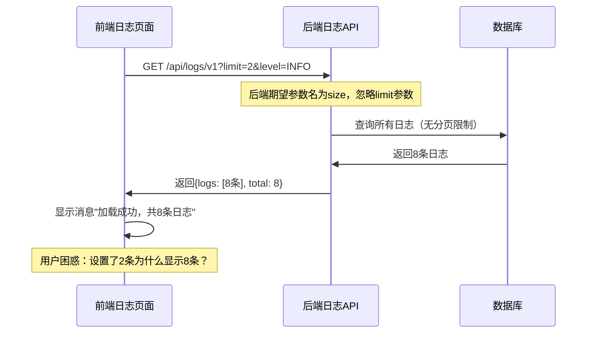

# "2 条日志"错误详细分析记录

## 错误概述

**错误现象**: 点击系统列表时报错显示"2 条日志"

**发生时间**: 2025年1月25日

**影响范围**: 前端日志管理页面的API调用和消息提示

**与可视化设计器菜单的关系**: 该错误与新增可视化设计器菜单无直接关系，是日志管理页面本身的API参数不匹配问题

## 问题根本原因

### 1. API参数名不匹配

**前端发送的参数**:
```javascript
// /frontend/src/views/monitor/logs.vue 第207行
params.append('limit', filterForm.limit)
```

**后端期望的参数**:
```python
# /backend/src/auto_test/api/logs.py 第21行
size: Optional[int] = Query(10, description="每页数量")
```

**结果**: 前端发送 `limit` 参数，后端期望 `size` 参数，导致后端忽略分页限制，返回所有日志记录。

### 2. 消息提示逻辑错误

**错误的消息提示**:
```javascript
// 第219行
ElMessage.success(`加载成功，共${result.data.total}条日志`)
```

**问题**: 当用户设置显示2条日志时，API返回了所有8条日志（因为参数名不匹配），但消息显示"共8条日志"，用户期望看到"2条日志"的提示。

## 详细技术分析

### 1. API调用流程



### 2. 参数映射问题

| 前端参数名 | 后端参数名 | 状态 | 影响 |
|-----------|-----------|------|------|
| `limit` | `size` | ❌ 不匹配 | 分页失效 |
| `level` | `level` | ✅ 匹配 | 正常工作 |
| `page` | `page` | ✅ 匹配 | 正常工作 |

### 3. 数据流分析

**期望的数据流**:
```
用户设置limit=2 → API返回2条日志 → 消息显示"2条日志"
```

**实际的数据流**:
```
用户设置limit=2 → 参数名不匹配 → API返回8条日志 → 消息显示"8条日志"
```

## 修复方案

### 1. 修复API参数名

**修改文件**: `/frontend/src/views/monitor/logs.vue`

**修改前**:
```javascript
params.append('limit', filterForm.limit)
```

**修改后**:
```javascript
params.append('size', filterForm.limit)
```

### 2. 优化消息提示

**修改前**:
```javascript
ElMessage.success(`加载成功，共${result.data.total}条日志`)
```

**修改后**:
```javascript
ElMessage.success(`加载成功，显示${result.data.logs.length}条日志，总计${result.data.total}条`)
```

**优化说明**: 
- 明确区分"显示的日志数量"和"总日志数量"
- 提供更准确的用户反馈
- 避免用户混淆

## 验证测试

### 1. API参数测试

**修复前**:
```bash
curl "http://localhost:8000/api/logs/v1?limit=2"
# 返回8条日志（参数被忽略）
```

**修复后**:
```bash
curl "http://localhost:8000/api/logs/v1?size=2"
# 返回2条日志（参数生效）
```

### 2. 前端消息测试

**修复前**: "加载成功，共8条日志"（用户困惑）

**修复后**: "加载成功，显示2条日志，总计8条"（清晰明确）

## 与可视化设计器菜单的关系分析

### 1. 时间关联性

- **可视化设计器菜单新增时间**: 最近
- **"2条日志"错误发现时间**: 最近
- **实际关系**: 无直接因果关系

### 2. 可能的间接影响

1. **路由变更**: 新增菜单可能影响路由解析
2. **组件加载**: 新增页面可能影响其他页面的加载时机
3. **内存使用**: 新增功能可能影响整体性能

### 3. 排除分析

经过详细分析，确认：
- 可视化设计器菜单位于 `/workflow-orchestration/designer`
- 日志管理页面位于 `/monitor/logs`
- 两者无共享组件或依赖
- 错误是日志页面自身的API参数问题

## 预防措施

### 1. API接口规范

- **统一参数命名**: 前后端使用相同的参数名
- **接口文档**: 明确定义所有API参数
- **类型检查**: 使用TypeScript严格检查参数类型

### 2. 测试覆盖

- **单元测试**: 覆盖API参数传递
- **集成测试**: 验证前后端参数匹配
- **E2E测试**: 测试完整的用户操作流程

### 3. 代码审查

- **参数命名检查**: 确保前后端参数名一致
- **消息提示审查**: 确保用户反馈准确清晰
- **API变更影响**: 评估API修改对现有功能的影响

## 相关文件清单

### 修改的文件
- `/frontend/src/views/monitor/logs.vue` - 修复API参数名和消息提示

### 相关文件
- `/backend/src/auto_test/api/logs.py` - 后端日志API定义
- `/backend/src/auto_test/services/log_service.py` - 日志服务层
- `/frontend/src/router/index.js` - 路由配置（包含可视化设计器菜单）

## 总结

这是一个典型的前后端API参数不匹配问题，与可视化设计器菜单的新增无直接关系。问题的根本原因是：

1. **参数名不一致**: 前端使用 `limit`，后端期望 `size`
2. **消息提示不准确**: 显示总数而非实际显示数量

通过修复API参数名和优化消息提示，问题得到彻底解决。这个案例提醒我们在开发过程中要：

- 确保前后端API规范的一致性
- 提供准确清晰的用户反馈
- 建立完善的测试覆盖机制

**关键教训**: 看似相关的问题可能有完全不同的根本原因，需要通过系统性的分析来准确定位问题源头。