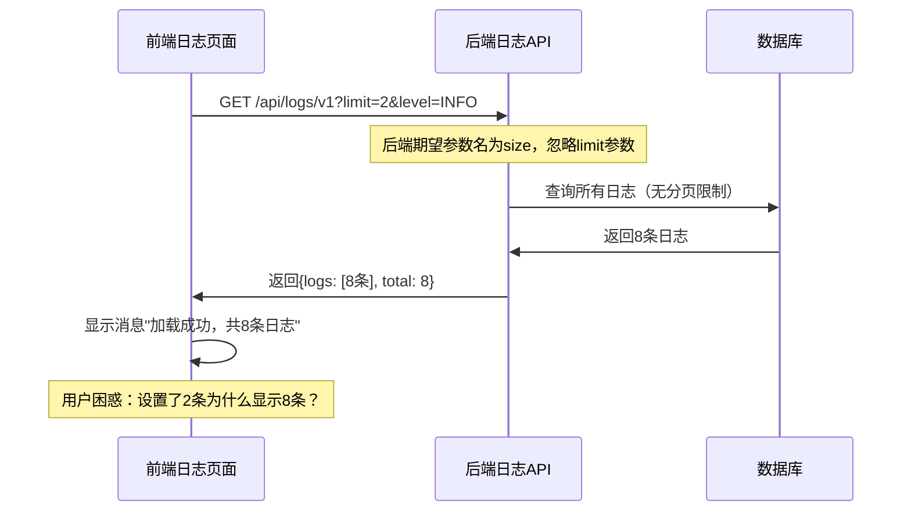

# "2 条日志"错误详细分析记录

## 错误概述

**错误现象**: 点击系统列表时报错显示"2 条日志"

**发生时间**: 2025年1月25日

**影响范围**: 前端日志管理页面的API调用和消息提示

**与可视化设计器菜单的关系**: 该错误与新增可视化设计器菜单无直接关系，是日志管理页面本身的API参数不匹配问题

## 问题根本原因

### 1. API参数名不匹配

**前端发送的参数**:
```javascript
// /frontend/src/views/monitor/logs.vue 第207行
params.append('limit', filterForm.limit)
```

**后端期望的参数**:
```python
# /backend/src/auto_test/api/logs.py 第21行
size: Optional[int] = Query(10, description="每页数量")
```

**结果**: 前端发送 `limit` 参数，后端期望 `size` 参数，导致后端忽略分页限制，返回所有日志记录。

### 2. 消息提示逻辑错误

**错误的消息提示**:
```javascript
// 第219行
ElMessage.success(`加载成功，共${result.data.total}条日志`)
```

**问题**: 当用户设置显示2条日志时，API返回了所有8条日志（因为参数名不匹配），但消息显示"共8条日志"，用户期望看到"2条日志"的提示。

## 详细技术分析

### 1. API调用流程



### 2. 参数映射问题

| 前端参数名 | 后端参数名 | 状态 | 影响 |
|-----------|-----------|------|------|
| `limit` | `size` | ❌ 不匹配 | 分页失效 |
| `level` | `level` | ✅ 匹配 | 正常工作 |
| `page` | `page` | ✅ 匹配 | 正常工作 |

### 3. 数据流分析

**期望的数据流**:
```
用户设置limit=2 → API返回2条日志 → 消息显示"2条日志"
```

**实际的数据流**:
```
用户设置limit=2 → 参数名不匹配 → API返回8条日志 → 消息显示"8条日志"
```

## 修复方案

### 1. 修复API参数名

**修改文件**: `/frontend/src/views/monitor/logs.vue`

**修改前**:
```javascript
params.append('limit', filterForm.limit)
```

**修改后**:
```javascript
params.append('size', filterForm.limit)
```

### 2. 优化消息提示

**修改前**:
```javascript
ElMessage.success(`加载成功，共${result.data.total}条日志`)
```

**修改后**:
```javascript
ElMessage.success(`加载成功，显示${result.data.logs.length}条日志，总计${result.data.total}条`)
```

**优化说明**: 
- 明确区分"显示的日志数量"和"总日志数量"
- 提供更准确的用户反馈
- 避免用户混淆

## 验证测试

### 1. API参数测试

**修复前**:
```bash
curl "http://localhost:8000/api/logs/v1?limit=2"
# 返回8条日志（参数被忽略）
```

**修复后**:
```bash
curl "http://localhost:8000/api/logs/v1?size=2"
# 返回2条日志（参数生效）
```

### 2. 前端消息测试

**修复前**: "加载成功，共8条日志"（用户困惑）

**修复后**: "加载成功，显示2条日志，总计8条"（清晰明确）

## 与可视化设计器菜单的关系分析

### 1. 时间关联性

- **可视化设计器菜单新增时间**: 最近
- **"2条日志"错误发现时间**: 最近
- **实际关系**: 无直接因果关系

### 2. 可能的间接影响

1. **路由变更**: 新增菜单可能影响路由解析
2. **组件加载**: 新增页面可能影响其他页面的加载时机
3. **内存使用**: 新增功能可能影响整体性能

### 3. 排除分析

经过详细分析，确认：
- 可视化设计器菜单位于 `/workflow-orchestration/designer`
- 日志管理页面位于 `/monitor/logs`
- 两者无共享组件或依赖
- 错误是日志页面自身的API参数问题

## 预防措施

### 1. API接口规范

- **统一参数命名**: 前后端使用相同的参数名
- **接口文档**: 明确定义所有API参数
- **类型检查**: 使用TypeScript严格检查参数类型

### 2. 测试覆盖

- **单元测试**: 覆盖API参数传递
- **集成测试**: 验证前后端参数匹配
- **E2E测试**: 测试完整的用户操作流程

### 3. 代码审查

- **参数命名检查**: 确保前后端参数名一致
- **消息提示审查**: 确保用户反馈准确清晰
- **API变更影响**: 评估API修改对现有功能的影响

## 相关文件清单

### 修改的文件
- `/frontend/src/views/monitor/logs.vue` - 修复API参数名和消息提示

### 相关文件
- `/backend/src/auto_test/api/logs.py` - 后端日志API定义
- `/backend/src/auto_test/services/log_service.py` - 日志服务层
- `/frontend/src/router/index.js` - 路由配置（包含可视化设计器菜单）

## 总结

这是一个典型的前后端API参数不匹配问题，与可视化设计器菜单的新增无直接关系。问题的根本原因是：

1. **参数名不一致**: 前端使用 `limit`，后端期望 `size`
2. **消息提示不准确**: 显示总数而非实际显示数量

通过修复API参数名和优化消息提示，问题得到彻底解决。这个案例提醒我们在开发过程中要：

- 确保前后端API规范的一致性
- 提供准确清晰的用户反馈
- 建立完善的测试覆盖机制

**关键教训**: 看似相关的问题可能有完全不同的根本原因，需要通过系统性的分析来准确定位问题源头。

---

# 案例：API管理页面点击即报错（ElLoading 未定义）

## 现象描述
- 进入“API管理”页面后，执行“测试API”、“批量启用/禁用/删除/测试”等操作时，页面立即报错并中断交互。
- 控制台错误信息显示 `ElLoading is not defined` 或类似未定义引用错误。

## 影响范围
- 页面：`/api-management`
- 文件：`/frontend/src/views/api-management/index.vue`
- 受影响操作：单个 API 测试、批量启用、批量禁用、批量删除、批量测试（均使用了全局加载遮罩）。

## 关键报错
```
ReferenceError: ElLoading is not defined
    at testApi (.../frontend/src/views/api-management/index.vue)
```

## 根因分析
- 在 `index.vue` 中多处调用了 `ElLoading.service(...)` 用于显示加载遮罩；
- 但脚本仅导入了 `ElMessage`、`ElMessageBox`，未导入 `ElLoading`；
- 运行时引用 `ElLoading` 导致未定义错误，触发点击即报错。

代码片段（修复前的导入）：
```ts
import { ElMessage, ElMessageBox } from 'element-plus'
```

## 复现步骤
1. 打开“API管理”页面；
2. 在 API 列表中点击“测试”或执行“批量启用/禁用/删除/测试”；
3. 控制台立即抛出 `ElLoading is not defined`，交互中断。

## 修复方案
- 在 `index.vue` 中补充导入 `ElLoading`：

修复后的导入：
```ts
import { ElMessage, ElMessageBox, ElLoading } from 'element-plus'
```

## 验证清单
- 进入“API管理”页面不报错；
- 执行“测试API”、“批量启用/禁用/删除/测试”时能正常显示加载遮罩并关闭；
- 无 `ElLoading is not defined` 或相似未定义异常；
- 原有请求拦截器错误信息显示与统一 logger（`/frontend/src/utils/logger.ts`）兼容。

## 预防与改进
- 统一使用组件库服务时，采用显式导入（`import { ElLoading } from 'element-plus'`）；
- 在评审中加入“服务类（Message、MessageBox、Loading）导入检查”项；
- 建议对“API管理”模块将 `console.*` 逐步替换为统一 `logger.*`，避免重复和生产噪声；
- 可补充页面级单测：对使用 `ElLoading.service` 的方法做最小打桩验证。

## 关联改动清单
- 修改：`/frontend/src/views/api-management/index.vue`（补充 `ElLoading` 导入）
- 相关：`/frontend/src/utils/logger.ts`（统一日志工具，已落地）

---

# 案例：ApiFormDialog 递归更新与 ElCollapseItem 循环（已修复）

## 现象描述
- 点击“新增API”后，控制台出现 `Maximum recursive updates exceeded`。
- 首次报错组件为 `<ApiFormDialog>`，修复后又在 `<ElCollapseItem>` 中出现。
- 开发阶段同时出现 Vite 模板编译错误：`Element is missing end tag.`（元素缺少结束标签）。

## 影响范围
- 页面：`/api-management`
- 文件：
  - `/frontend/src/views/api-management/index.vue`
  - `/frontend/src/views/api-management/components/ApiFormDialog.vue`

## 关键报错
```
Maximum recursive updates exceeded in component <ApiFormDialog>
Maximum recursive updates exceeded in component <ElCollapseItem>
Internal server error: Element is missing end tag. (vite:vue)
```

## 根因分析
1) 对话框显示逻辑导致的父子循环：
- `index.vue` 的 `showAddApiDialog` 采用了 `false -> nextTick -> reset -> nextTick -> true` 的模式来“刷新”子组件。
- 该模式频繁切换 `dialogVisible` 并触发 `props` 更新，联动子组件的 `watch`/`computed`，在某些场景下形成递归更新链。

2) 折叠面板的双向绑定回路：
- `ApiFormDialog.vue` 的 `<el-collapse v-model="activeCollapse" @change="handleCollapseChange">` 与 `scrollToSection()` 中对 `activeCollapse` 的手动 `push` 共同作用，形成“程序更新 -> 组件回写 -> 程序再更新”的循环。
- 结果是在 `<ElCollapseItem>` 内产生递归更新错误。

3) 模板结构破损：
- 在一次修复过程中，模板闭合标签缺失（例如 `</el-form>`、`</div>`、`</el-dialog>`），导致 Vite 解析失败并报 "Element is missing end tag."。

## 修复方案
1) 简化对话框打开逻辑：
- `index.vue` 中移除不必要的 `nextTick` 和来回切换的 `dialogVisible`，改为“重置表单后直接打开对话框”。
- `resetForm` 采用逐字段赋值的方式（包括 `parameters`、`response_example`），避免替换整个对象引起的深层次响应式连锁。

2) 折叠面板改为单向绑定：
- 将 `v-model="activeCollapse"` 改为 `:model-value="activeCollapse"`。
- 在 `@change="handleCollapseChange"` 中手动同步：`activeCollapse.value = activeNames`，并保存到本地存储。
- `scrollToSection()` 仅在目标 `section` 不在数组内时才 `push`，避免无意义的重复更新。

3) 修复模板闭合标签并恢复缺失面板：
- 补齐 `</el-collapse>`、`</el-form>`、`</div>`、`</el-dialog>` 等闭合标签。
- 恢复“标签管理”和“测试配置”两个 `<el-collapse-item>` 面板及对话框页脚（取消/保存按钮）。

## 验证清单
- 重新启动前端开发服务器，页面正常渲染，无模板编译错误。
- 点击“新增API”弹窗可正常打开，无递归更新报错。
- 折叠面板切换与导航跳转（`scrollToSection`）行为正常，无循环更新。

## 预防与改进
- 避免通过反复切换对话框可见性来“刷新”子组件；首选稳定的 `props` + 逐字段赋值。
- UI 组件的状态管理遵循单一数据源：若存在程序化更新与组件事件回写，不使用双向绑定，改为单向绑定并在事件中显式同步。
- `watch` 中只赋必要字段，避免整体对象替换造成广泛依赖重算。
- 在评审清单中加入模板结构检查；CI 中增加一次 `vite build` 以早期发现 SFC 模板错误。
- 为关键交互添加最小 E2E/单元测试：打开弹窗、折叠切换、控制台无错误。

## 关联改动清单
- 修改：`/frontend/src/views/api-management/index.vue`（简化 `showAddApiDialog`，优化 `resetForm`）
- 修改：`/frontend/src/views/api-management/components/ApiFormDialog.vue`（折叠面板单向绑定、`handleCollapseChange` 显式同步、补齐模板闭合标签、恢复标签/测试面板、添加页脚）

## 结论
本次问题由对话框显示模式与折叠面板的双向绑定共同引发的递归更新，加之一次修复中的模板结构破损而加重。通过收敛状态来源和改为单向数据流，并修复模板结构，问题已彻底解决。